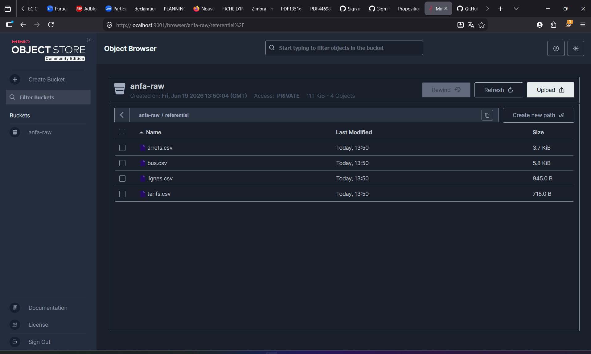

# Rendu Séance 1

**Nom et prénom :** Kaltchagba  
**Cours :** Cloud & Big Data — ESGIS Master 1 IA/**Professeur :** M. AKPAGNONITE
**Date :** 19 juin 2026

---

## Résumé de la séance

Cette première séance avait pour objectif de poser la toute première brique de la plateforme data **Anfa**, le projet fil rouge du module. Concrètement, il s'agissait de mettre en place un service de stockage objet local — **MinIO** — en le faisant tourner dans un conteneur Docker, puis d'écrire un script Python capable d'y déposer automatiquement les données de référence du projet (lignes de bus, arrêts, véhicules, tarifs).

Ce qui m'a frappé dès le début, c'est à quel point cette configuration locale reproduit fidèlement ce qu'on ferait sur Amazon S3 en production. Le script Python que j'ai écrit avec `boto3` n'aurait besoin que de changer deux lignes pour pointer vers AWS — c'est exactement le principe de portabilité que le cours met en avant depuis la première heure.

À la fin de la séance, le bucket `anfa-raw` contient les quatre fichiers CSV du référentiel sous le préfixe `referentiel/`, MinIO tourne de manière persistante grâce à un volume Docker, et tout le code est versionné sur ma branche `seance-01`.

---

## Étapes principales

1. **Fork et mise en place du dépôt** — Fork du dépôt `denisakp/cloud-bigdata-anfa-resources` vers mon compte GitHub, clonage en local et création de la branche `seance-01`.

2. **Lancement de MinIO dans Docker** — Téléchargement de l'image `minio/minio` puis démarrage du conteneur `anfa-minio` avec deux ports exposés (9000 pour l'API S3, 9001 pour la console web) et un volume Docker persistant `anfa-minio-data`.

3. **Configuration via `mc`** — Connexion au conteneur en mode interactif, configuration d'un alias `local` pointant vers l'instance MinIO, création du bucket `anfa-raw`, puis génération d'une paire de clés applicatives (`anfa-app-key` / `anfa-app-secret-2026`) pour le script Python.

4. **Écriture et exécution du script Python** — Création de l'environnement virtuel, installation de `boto3`, puis écriture de `upload_referentiel.py` qui vérifie l'accès au bucket, uploade les quatre CSV et liste le contenu pour confirmation.

5. **Vérification visuelle** — Consultation de la console MinIO sur http://localhost:9001 pour s'assurer que les quatre fichiers sont bien présents sous `referentiel/`.

6. **Rédaction du fichier docker-compose.yml** — Traduction de la commande `docker run` en fichier YAML versionnable, en déclarant le volume comme externe.

---

## Capture d'écran

*Console MinIO — bucket `anfa-raw`, dossier `referentiel/` avec les quatre CSV.*



---

## Difficultés rencontrées

### 1. La console web MinIO ne permet pas de créer de bucket

C'est la première chose qui m'a déconcerté. Mon réflexe naturel a été d'aller sur http://localhost:9001, de chercher un bouton "Create bucket" — et de ne pas le trouver. J'ai d'abord pensé à un bug, puis à un problème de droits. En réalité, c'est un changement de comportement dans les versions récentes de MinIO : la console web est désormais en lecture seule pour l'administration. Toutes les opérations de création (bucket, utilisateurs, clés) passent exclusivement par `mc` à l'intérieur du conteneur. Une fois cette logique comprise, tout s'est débloqué.

### 2. Les identifiants root ne fonctionnent pas avec boto3

Deuxième surprise : j'ai d'abord essayé de configurer le client boto3 avec `anfa-admin` / `anfa-password-2026` — exactement les mêmes identifiants qui fonctionnent pour la console web. Le script retournait immédiatement `InvalidAccessKeyId`. Ce qui n'est pas intuitif, c'est que MinIO sépare deux "plans" d'authentification : les credentials root servent à administrer le serveur (via `mc` ou la console), mais l'API S3 elle-même n'accepte que des **clés de service account** créées explicitement. Une fois que j'ai compris que ces deux plans sont distincts — exactement comme AWS IAM sépare les accès console des clés programmatiques — j'ai su qu'il fallait passer par `mc admin user svcacct add` avant de toucher au script Python.

### 3. Le venv sous Windows

L'activation de l'environnement virtuel via `.venv\Scripts\Activate.ps1` échoue sur Windows avec un message d'erreur lié à la politique d'exécution de PowerShell. La solution est simple mais il faut la connaître : `Set-ExecutionPolicy -ExecutionPolicy RemoteSigned -Scope CurrentUser`. Ce n'est pas quelque chose qu'on apprend en lisant la doc de Python — c'est une spécificité Windows qui surprend au premier contact.

---

## Exercices d'application

### Exercice 1 — QCM conceptuel

**1.1 → D. Open source obligatoire**

La réponse D est fausse, et c'est bien celle qu'il faut identifier. Le NIST définit le cloud computing par cinq caractéristiques qui décrivent ce qu'un service *fait* — libre-service, accès réseau, mutualisation, élasticité, facturation à l'usage — et non ce sur quoi il est *construit*. AWS, GCP et Azure sont à 100 % des clouds au sens NIST, et pourtant ils exposent massivement des services propriétaires. L'open source est une stratégie de portabilité pour éviter le vendor lock-in, pas un prérequis au label "cloud".

**1.2 → C. SaaS**

Gmail est une application finie, livrée clé en main via un navigateur. L'utilisateur ne touche ni à l'OS, ni au runtime, ni aux serveurs : il gère uniquement ses e-mails et ses préférences. Google prend en charge l'intégralité du reste — infrastructure, mises à jour, disponibilité, sécurité des serveurs. C'est exactement la définition du SaaS : "vous gérez vos données et vos préférences, le fournisseur gère tout le reste."

**1.3 → D. FaaS**

Deux mots-clés dans l'énoncé orientent immédiatement vers le FaaS : *déclenche* (modèle événementiel) et *sans serveur dédié tournant en permanence* (pas de processus persistant). En IaaS ou PaaS, un serveur tourne 24h/24 même quand il n'y a rien à traiter. En FaaS, la fonction n'existe que le temps de son exécution — quelques dizaines de millisecondes. Le CM illustre précisément ce cas pour Anfa : la fonction `verifier_position` dure 50 ms et coûte 0,0013 FCFA. La limite de 15 minutes des fonctions cloud est sans aucun problème compatible avec une vérification de cohérence GPS.

**1.4 → C. Cloud hybride**

La banque se retrouve face à deux contraintes qui s'opposent : isoler au maximum les données réglementées (ce qui pousse vers le cloud privé ou l'on-premise) et profiter de l'élasticité du cloud pour ses analyses non sensibles (ce qui pousse vers le cloud public). Aucun des deux modèles pris isolément ne répond aux deux exigences à la fois. Le cloud hybride est précisément conçu pour ça : données sensibles dans un environnement contrôlé, traitements élastiques dans le cloud public. C'est d'ailleurs le modèle que le CM recommande pour Anfa elle-même.

**1.5 → B. La situation où une entreprise ne peut plus changer de fournisseur sans coûts ou risques majeurs**

Le vendor lock-in n'est ni un contrat (A), ni une technique de chiffrement (C), ni une loi (D) — c'est une dépendance technologique et économique qui s'installe progressivement, souvent sans qu'on s'en rende compte. Le CM cite un cas concret (slide 33) : une entreprise ayant migré 10 To de données vers un service propriétaire qui, quand le fournisseur a doublé ses prix, s'est retrouvée avec une facture de migration estimée à 18 mois de travail et 1,31 milliard de FCFA. Ce n'est pas une contrainte imposée de l'extérieur — c'est une situation qu'on a construite soi-même, choix technique après choix technique.

**1.6 → C. Un service open source est forcément moins performant qu'un service managé propriétaire**

Cette affirmation est fausse, et les exemples ne manquent pas pour le démontrer. Amazon EMR — l'un des services de traitement distribué les plus utilisés au monde — repose sur Apache Spark et Hadoop. AWS SageMaker intègre TensorFlow, MLflow et Kubeflow. Google Dataproc tourne sur Spark. La performance d'un service dépend de son architecture, de son optimisation et des ressources qui lui sont allouées — pas de sa licence. Open source et haute performance ne sont pas contradictoires, ils vont souvent ensemble.

---

### Exercice 2 — Classification de services

| Service | Modèle | Justification |
|---|---|---|
| Google Compute Engine | IaaS | On loue une machine virtuelle brute sur laquelle on installe soi-même l'OS, le runtime et les applications. Contrôle maximal, effort de gestion maximal. |
| AWS Lambda | FaaS | On déploie une fonction déclenchée par un événement, facturée à la milliseconde. Il n'y a aucun serveur à provisionner ni à maintenir. |
| Snowflake | SaaS | Entrepôt de données 100 % managé, accessible via une simple URL. L'utilisateur écrit du SQL ; Snowflake gère l'infrastructure, le scaling et les mises à jour. |
| Heroku | PaaS | On pousse son code (`git push heroku`), la plateforme prend en charge le déploiement, le runtime, le scaling et le réseau. On ne touche jamais aux serveurs. |
| Microsoft 365 | SaaS | Word, Excel et Outlook sont accessibles dans le navigateur sans aucune installation. L'utilisateur gère ses fichiers ; Microsoft gère tout le reste. |
| Databricks | PaaS | Spark managé : on écrit des notebooks et des jobs, la plateforme gère les clusters, les mises à jour et la haute disponibilité. Le CM le cite explicitement en exemple PaaS (slide 21). |
| Azure Functions | FaaS | Même modèle qu'AWS Lambda : fonctions déclenchées par événement, facturation à l'exécution à la milliseconde, zéro serveur permanent. |
| Tableau Online | SaaS | Outil de Business Intelligence accessible depuis n'importe quel navigateur, sans installation locale. Le CM le cite en exemple SaaS (slide 23). |

---

### Exercice 3 — Lecture et interprétation

#### 3.1 — Analyse de la commande docker run

```bash
docker run -d --name analyse-anfa -p 8888:8888 -v /home/koffi/notebooks:/notebooks \
  -e JUPYTER_TOKEN=anfa-token \
  jupyter/pyspark-notebook
```

| Option | Ce qu'elle fait |
|---|---|
| `-d` | Lance le conteneur en arrière-plan (*detached*) : le terminal est libéré immédiatement, le processus continue en fond. |
| `--name analyse-anfa` | Donne un nom lisible au conteneur, ce qui permet de le référencer ensuite dans `docker stop analyse-anfa`, `docker logs analyse-anfa`, etc. Sans ce nom, Docker en génère un aléatoire. |
| `-p 8888:8888` | Publie le port 8888 du conteneur sur le port 8888 de la machine hôte. C'est ce qui rend Jupyter accessible sur http://localhost:8888 depuis le navigateur. |
| `-v /home/koffi/notebooks:/notebooks` | Monte le dossier local `/home/koffi/notebooks` à l'emplacement `/notebooks` dans le conteneur (*bind mount*). Tout notebook créé dans Jupyter est physiquement écrit sur la machine de Koffi et survit à la suppression du conteneur. |
| `-e JUPYTER_TOKEN=anfa-token` | Injecte la variable d'environnement `JUPYTER_TOKEN` dans le conteneur. Jupyter l'utilise comme mot de passe : on ne peut pas ouvrir l'interface sans saisir `anfa-token`. |
| `jupyter/pyspark-notebook` | L'image Docker à utiliser, publiée sur Docker Hub. Elle contient Python, Jupyter Notebook et PySpark préinstallés — prête à l'emploi. |

**En résumé :** cette commande lance un serveur Jupyter avec PySpark, accessible sur http://localhost:8888 et protégé par le token `anfa-token`, en arrière-plan. Les notebooks sont sauvegardés sur la machine de Koffi dans `/home/koffi/notebooks` — ils ne disparaîtront pas si le conteneur est supprimé.

---

#### 3.2 — Lecture du docker-compose.yml

**a. Adresses d'accès depuis le navigateur de l'hôte :**

- **http://localhost:9000** — l'API S3, le point d'entrée pour les programmes (boto3, mc, etc.)
- **http://localhost:9001** — la console web d'administration MinIO

**b. Les données sont-elles perdues après `docker rm` puis `docker compose up -d` ?**

Non, et c'est l'un des points les plus importants à comprendre sur Docker. Les données ne sont pas stockées *dans* le conteneur, mais dans le volume nommé `minio-data` déclaré dans la section `volumes:`. Un volume Docker a une existence indépendante du conteneur qui l'utilise : `docker rm anfa-minio` supprime le conteneur, mais le volume reste intact sur le disque. Quand on relance `docker compose up -d`, un nouveau conteneur est créé et se rattache au même volume — les données sont exactement là où on les avait laissées. La seule commande qui supprimerait le volume (et donc les données) est `docker compose down -v`, avec le flag `-v` explicite.

**c. Problème de sécurité à corriger pour la production :**

Le mot de passe root `secret` est écrit en clair directement dans le fichier YAML. Si ce fichier est versionné dans Git — ce qui est son but premier — les credentials se retrouvent exposés à toute personne ayant accès au dépôt, y compris si le dépôt est public. En production, les secrets ne doivent jamais apparaître dans le code source : on les externalise dans un fichier `.env` non versionné (ajouté au `.gitignore`), ou on les injecte via un gestionnaire de secrets dédié (HashiCorp Vault, Kubernetes Secrets, Docker Swarm secrets). Par ailleurs, le mot de passe `secret` est trivial à deviner par force brute — un mot de passe généré aléatoirement est indispensable.

---

### Exercice 4 — Diagnostic

**a. Cause précise de l'erreur :**

MinIO implémente le protocole d'authentification **AWS Signature Version 4**, qui est aussi celui d'Amazon S3. Dans ce protocole, le champ `aws_access_key_id` doit correspondre à un *service account* — un compte de service enregistré dans le système d'identité de MinIO avec ses propres permissions. Or `anfa-admin` est le credential du **plan d'administration** : il authentifie les connexions à la console web et les commandes `mc admin`, mais il n'existe tout simplement pas dans la table des access keys S3. Quand boto3 construit sa requête `PutObject` et la signe avec `anfa-admin` comme access key ID, MinIO cherche cette valeur parmi ses service accounts, ne la trouve pas, et retourne l'erreur `InvalidAccessKeyId`.

**b. Correction du code :**

Il faut remplacer les identifiants root par les clés de service account créées à l'étape 3.4 du TP :

```python
s3 = boto3.client(
    "s3",
    endpoint_url="http://localhost:9000",
    aws_access_key_id="anfa-app-key",              # ← clé de service account
    aws_secret_access_key="anfa-app-secret-2026",  # ← secret correspondant
    region_name="us-east-1",
)
```

**c. Pourquoi MinIO refuse-t-il les credentials root pour l'API S3 ?**

MinIO expose deux plans d'authentification complètement séparés, exactement comme AWS sépare la console IAM de l'API programmatique :

- **Plan d'administration** (console web port 9001, commandes `mc admin`) : accepte le couple `MINIO_ROOT_USER` / `MINIO_ROOT_PASSWORD` défini au démarrage du serveur.
- **Plan S3** (API port 9000, requêtes boto3) : n'accepte que des access keys de service accounts, créées explicitement via `mc admin user svcacct add`.

C'est une décision de conception délibérée, héritée du modèle de sécurité d'AWS IAM : on ne donne jamais les credentials root à une application. Si les clés d'une application sont compromises, on les révoque sans toucher au mot de passe root. Chaque application reçoit le minimum de permissions dont elle a besoin — c'est le principe du moindre privilège.

---

### Exercice 5 — Mini-cas d'architecture (PME togolaise e-commerce)

**a. Deux limites concrètes de l'architecture actuelle :**

1. **La granularité des données est incompatible avec le besoin.** Un export CSV mensuel signifie que les données ont en moyenne quinze jours de retard. Demander à un modèle de prédire la demande "à l'heure" à partir d'une source qui se rafraîchit une fois par mois, c'est comme essayer de naviguer avec une carte vieille d'un mois dans une ville en construction permanente. Les prédictions horaires ne peuvent pas reposer sur des données mensuelles — la contrainte est structurelle, pas technique.

2. **L'architecture repose sur un point de défaillance unique (SPOF).** Toute la valeur data de l'entreprise dépend d'un seul ordinateur portable, celui de Toyi. Une absence, une panne, une mise à jour système qui plante — et plus aucune prédiction n'est possible. Pour un service censé fonctionner toutes les heures, 24h/24, cette fragilité est rédhibitoire. Le cloud règle ce problème en distribuant la charge et en offrant une disponibilité garantie par contrat (SLA).

**b. Caractéristique NIST pour chaque besoin :**

- *Prédictions chaque heure* → **Élasticité rapide.** Le job de prédiction horaire a besoin de ressources de calcul pendant quelques minutes, puis n'en a plus besoin. Sur un laptop aux ressources fixes, ce cycle d'allocation/libération à la demande est impossible. Sur le cloud, des machines se provisionnent en quelques secondes pour le traitement, puis disparaissent — on ne paye que ce temps-là.

- *Tableau de bord partagé, sans installation* → **Accès réseau large.** N'importe quel analyste accède au dashboard depuis n'importe quel terminal — PC au bureau, smartphone en déplacement, tablette en réunion — via une simple URL HTTPS. Aucun logiciel à installer, aucune version à maintenir.

- *Augmenter la capacité aux pics* → **Élasticité rapide.** Le vendredi soir ou pendant les fêtes, le volume de commandes explose. Le cloud permet d'ajouter des ressources à la demande pour absorber ce pic, puis de les retirer quand la charge retombe. On scale à la hausse et à la baisse sans rien acheter.

- *Maîtriser les coûts* → **Service mesuré (pay-as-you-go).** On paye uniquement les ressources réellement consommées, à la seconde. Le job de prédiction qui tourne 10 minutes par heure n'est facturé que ces 10 minutes — pas 24h/24. Cela dit, le CM rappelle un piège important (slide 17) : "pay-as-you-go ne signifie pas forcément moins cher" si on ne gouverne pas bien la consommation.

- *Données clients en environnement contrôlé* → Aucune des cinq caractéristiques NIST ne répond directement à cette contrainte : elles décrivent *comment* le cloud délivre de la puissance de calcul, pas *où* les données sont physiquement stockées. Ce besoin est satisfait par le choix du **modèle de déploiement** (cloud privé ou hybride). Si l'on veut forcer une réponse NIST, on peut mentionner la **mutualisation des ressources** en mode cloud privé, où les ressources sont partagées mais exclusivement au sein de l'organisation, garantissant l'isolation physique et logique.

**c. Modèle de service pour chaque composant :**

- *Tableau de bord partagé* → **SaaS.** L'équipe métier veut accéder à un dashboard sans rien installer. C'est la définition exacte du SaaS : un outil clé en main consommé via le navigateur (Metabase Cloud, Tableau Online, Looker). Aucun serveur à gérer, aucune mise à jour à appliquer.

- *Calcul des prédictions à l'heure* → **FaaS.** Un déclencheur horaire lance une fonction qui charge le modèle, calcule les prédictions sur les nouvelles commandes, et s'arrête. Facturation à l'exécution, zéro serveur permanent, coût proportionnel à 24 lancements quotidiens. Si le modèle est lourd et dépasse la limite de durée des fonctions (typiquement 15 minutes), un **PaaS** type Azure ML ou SageMaker serait plus approprié.

- *Stockage des données clients* → **IaaS.** La contrainte de conformité impose de savoir exactement où les données résident, sur quel matériel, dans quel datacenter. En PaaS ou SaaS, cette transparence disparaît : le fournisseur décide. L'IaaS — voire une infrastructure on-premise — est le seul modèle qui offre ce niveau de contrôle, au prix d'un effort opérationnel plus important.

**d. Modèle de déploiement recommandé :**

Je recommande un **cloud hybride**. Les données clients sensibles restent dans un environnement privé (cloud privé dédié ou infrastructure on-premise) pour satisfaire les contraintes de conformité : l'entreprise sait exactement où elles se trouvent et qui y accède. Les capacités de calcul — inférence horaire, scaling aux pics du vendredi — s'appuient sur le cloud public pour bénéficier de l'élasticité sans investissement matériel. Les deux environnements communiquent via des connexions chiffrées et sécurisées. C'est précisément l'architecture que le CM décrit pour Anfa (slide 29) : "données passagers dans un cloud privé local, traitements analytiques dans le cloud public."

**e. Trois stratégies concrètes pour limiter le vendor lock-in :**

1. **Conteneuriser toutes les applications avec Docker.** Un conteneur est une unité portable : la même image tourne à l'identique sur AWS, GCP, Azure ou sur un serveur on-premise. Si le fournisseur change, seule la plateforme d'exécution change — le code, la configuration et le comportement restent exactement les mêmes. C'est le fil rouge de ce cours, et c'est ce que nous faisons dès ce premier TP.

2. **Privilégier les outils open source qui respectent des standards ouverts.** Utiliser MinIO (compatible API S3) plutôt qu'Amazon S3 natif, Kafka plutôt que Kinesis, Airflow plutôt que Cloud Composer. Ces outils s'installent sur n'importe quel environnement. Si demain le fournisseur cloud double ses prix, on migre la plateforme d'hébergement — pas le code applicatif, pas les pipelines, pas les modèles.

3. **Décrire l'infrastructure en code avec Terraform.** Terraform décrit ce qu'on veut (des serveurs, des buckets, des réseaux) sans dire chez quel fournisseur. Changer de cloud devient une affaire de quelques lignes dans la configuration du provider, pas une réécriture complète. Nous aborderons Terraform en séance 4 — c'est l'une des compétences les plus recherchées en data engineering aujourd'hui.
