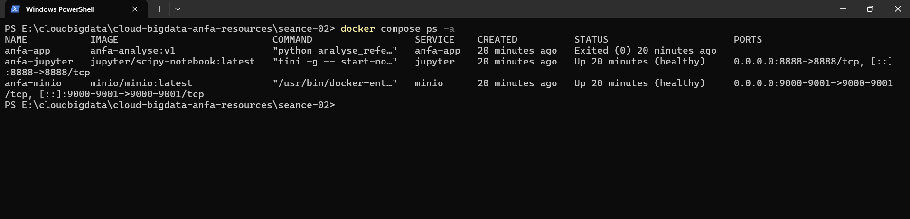
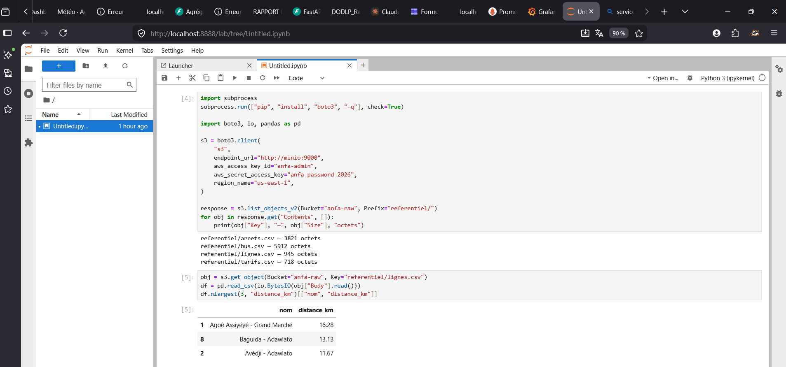

# Rendu Séance 2

**Nom et prénom :** TCHAGBA Kaled  
**Identifiant GitHub :** kaltchagba  
**Professeur :** M. AKPAGNONITE  
**Date de soumission :** 25/06/2026

---

## Résumé de la séance

Cette séance m'a permis de passer d'un script Python qui "tourne sur ma machine" à une application réellement portable. J'ai écrit mon premier Dockerfile pour conteneuriser le script PySpark d'analyse du référentiel Anfa, puis orchestré une stack de trois services avec Docker Compose : MinIO pour le stockage, Jupyter pour l'exploration interactive, et mon image custom pour l'analyse batch.

Ce qui m'a le plus marqué c'est la distinction image/conteneur. Une image est un modèle figé et reproductible — une fois construite, elle tourne à l'identique sur n'importe quelle machine. Le conteneur est l'instance vivante de cette image. J'ai vu cette promesse de portabilité concrètement : construire une fois, exécuter partout.

---

## Étapes principales

1. **Écriture du Dockerfile** — Image de base `python:3.11-slim-bookworm`, installation de Java 17 (requis par PySpark), variables d'environnement Python, copie des dépendances avant le code pour tirer parti du cache.

2. **Construction et test de l'image** — `docker build -t anfa-analyse:v1 .` puis `docker run` avec le dossier `data/referentiel/` monté en lecture seule. Taille finale : **1,17 Go** (Java + PySpark représentent l'essentiel du poids).

3. **Cache et `.dockerignore`** — En modifiant uniquement le script Python sans toucher à `requirements.txt`, le second build a réutilisé toutes les couches en cache et s'est terminé en quelques secondes. Le `.dockerignore` évite d'envoyer les fichiers inutiles au daemon.

4. **Stack Docker Compose 3 services** — `docker-compose.yml` avec MinIO (healthcheck), Jupyter (`depends_on: minio: condition: service_healthy`) et `anfa-app` (batch, `restart: "no"`).

5. **Notebook Jupyter** — Connexion à MinIO depuis Jupyter via `boto3` avec l'endpoint `http://minio:9000` (et non `localhost`), liste des objets du bucket, lecture de `lignes.csv` avec pandas et affichage du top 3 des lignes.

6. **Build multi-stage** — Construction d'une image `anfa-analyse:v2-multistage` séparant la phase d'installation des dépendances de la phase d'exécution. Résultat : même taille finale ici (Java + PySpark dominent), mais la technique est pertinente pour des applications sans dépendances C compilées.

---

## Captures d'écran

### docker compose ps — État des 3 services



### Notebook Jupyter — Lecture de MinIO avec pandas



---

## Difficultés rencontrées

### 1. anfa-app s'affiche Exited — est-ce une erreur ?

La première fois que j'ai vu `anfa-app` avec le statut `Exited (0)` dans `docker compose ps`, j'ai cru à un crash. En réalité c'est le comportement normal d'une application **batch** : le script PySpark s'exécute, produit son analyse, et se termine avec le code 0 (succès). `Exited (0)` signifie "terminé correctement" — c'est pour ça que le Compose définit `restart: "no"`, pour ne pas relancer indéfiniment un job qui s'est déjà bien terminé.

### 2. Jupyter ne pouvait pas joindre MinIO avec localhost

Mon réflexe a été d'utiliser `endpoint_url="http://localhost:9000"` dans le notebook — la même adresse qu'en séance 1. Ça échouait avec une erreur `Connection refused`. La raison : à l'intérieur d'un conteneur, `localhost` pointe vers le conteneur lui-même, pas vers les autres services. Docker Compose crée un réseau interne où chaque service est accessible par son **nom de service**. Il fallait utiliser `http://minio:9000`. Une fois compris, ce réflexe change radicalement la façon de penser les architectures multi-conteneurs.

### 3. Conflit de conteneur au démarrage

En lançant `docker compose up`, une erreur signalait que le nom `anfa-minio` était déjà pris par le conteneur de la séance 1, qui n'avait pas été supprimé. Solution : `docker stop anfa-minio && docker rm anfa-minio` avant de relancer. Ça m'a rappelé que les conteneurs lancés manuellement et ceux gérés par Compose partagent le même environnement Docker.

---

## Exercices d'application

### Exercice 1 — QCM conceptuel

**1.1 → C. Un conteneur partage le noyau de la machine hôte.**

Contrairement à une machine virtuelle qui embarque son propre noyau complet (et qui doit donc booter un OS entier), un conteneur utilise directement le noyau de l'hôte et l'isole via des mécanismes noyau. C'est ce qui le rend beaucoup plus léger et rapide à démarrer.

**1.2 → B. L'image est un modèle figé en lecture seule ; le conteneur est une instance en cours d'exécution.**

La relation est similaire à une classe et un objet en POO. L'image est immuable, on peut en instancier autant de conteneurs qu'on veut. Chaque conteneur ajoute sa propre couche d'écriture temporaire par-dessus les couches de l'image.

**1.3 → B. Les namespaces.**

Les namespaces Linux permettent de donner à un processus une vue isolée de certaines ressources : ses processus visibles (`pid`), son réseau (`net`), son système de fichiers (`mnt`), etc. Chaque conteneur vit dans sa propre bulle — il ne voit pas les processus des autres conteneurs.

**1.4 → A. Les cgroups.**

Les cgroups (control groups) limitent la *consommation* de ressources : CPU, mémoire, I/O. Là où les namespaces isolent ce qu'un conteneur *voit*, les cgroups contrôlent ce qu'il *consomme*. C'est grâce à eux qu'on peut imposer une limite mémoire à un conteneur.

**1.5 → B. Dans une machine virtuelle Linux invisible gérée par Docker Desktop.**

macOS n'a pas de noyau Linux. Docker Desktop démarre silencieusement une VM Linux légère dans laquelle tous les conteneurs s'exécutent. C'est transparent pour l'utilisateur mais c'est pour ça que Docker Desktop consomme plus de mémoire qu'une installation native sur Linux.

**1.6 → B. La société d'origine qui a créé et open-sourcé Docker en 2013.**

DotCloud était une startup de PaaS qui utilisait la conteneurisation en interne. Face à la pression concurrentielle, ils ont décidé d'open-sourcer cet outil. Docker a été présenté en 2013 et a connu un succès immédiat. DotCloud s'est ensuite renommée Docker Inc.

**1.7 → C. Docker a apporté un format d'image portable, une CLI simple et un registre public, en s'appuyant sur les mêmes primitives que LXC.**

LXC existait avant Docker et utilisait déjà namespaces et cgroups. Ce que Docker a ajouté : un format d'image standardisé, une CLI accessible à tout développeur (`docker build`, `docker run`, `docker push`) et Docker Hub pour partager les images. Il a rendu la technologie accessible là où LXC restait réservé aux experts système.

**1.8 → B. Open Container Initiative — une norme ouverte pour les images et le runtime.**

L'OCI définit deux spécifications : le format d'image et le comportement du runtime. Grâce à l'OCI, une image construite avec Docker peut être exécutée par d'autres runtimes (containerd, podman, CRI-O) sans modification. C'est ce qui garantit l'interopérabilité de l'écosystème.

---

### Exercice 2 — Lecture et analyse d'un Dockerfile

```dockerfile
FROM python:3.11
WORKDIR /application
COPY . /application
RUN pip install -r requirements.txt
EXPOSE 5000
CMD ["python", "main.py"]
```

**2.1 — Rôle de chaque instruction :**

| Instruction | Ce qu'elle fait |
|---|---|
| `FROM python:3.11` | Image de base : Python 3.11 sur Debian complet (~900 Mo). Point de départ de toutes les couches suivantes. |
| `WORKDIR /application` | Crée `/application` et le définit comme répertoire de travail pour les instructions suivantes. |
| `COPY . /application` | Copie tout le contexte de build (dossier courant de l'hôte) vers `/application` dans l'image. |
| `RUN pip install -r requirements.txt` | Installe les dépendances Python au moment du build. Crée une couche immuable dans l'image. |
| `EXPOSE 5000` | Déclare que l'application utilise le port 5000. C'est purement documentaire — n'ouvre aucun port réellement. |
| `CMD ["python", "main.py"]` | Commande par défaut au démarrage d'un conteneur. Peut être surchargée à l'exécution. |

**2.2 — EXPOSE vs `-p 5000:5000` :**

`EXPOSE 5000` est une annotation dans l'image — elle documente le port utilisé mais ne crée aucune règle réseau. Le service reste inaccessible depuis l'hôte.

`-p 5000:5000` au `docker run` (ou `ports:` dans Compose) crée réellement la règle de redirection : le port 5000 de l'hôte est mappé vers le port 5000 du conteneur. Sans ça, rien n'entre depuis l'extérieur, même si `EXPOSE` est présent.

**2.3 — Deux problèmes selon les bonnes pratiques :**

**Problème 1 — Image de base trop lourde.**  
`python:3.11` pèse environ 900 Mo et embarque des outils de compilation et des headers C inutiles à l'exécution. `python:3.11-slim-bookworm` fait environ 150 Mo et contient uniquement l'essentiel pour faire tourner Python.

**Problème 2 — L'ordre COPY/RUN casse le cache à chaque modification.**  
En copiant tout le projet avant d'installer les dépendances, le moindre changement dans `main.py` invalide le cache et force `pip install` à tout réinstaller, même si `requirements.txt` n'a pas bougé. Il faut copier `requirements.txt` seul en premier, installer, puis copier le reste du code.

**2.4 — Version corrigée :**

```dockerfile
FROM python:3.11-slim-bookworm

ENV PYTHONDONTWRITEBYTECODE=1 \
    PYTHONUNBUFFERED=1

WORKDIR /app

COPY requirements.txt .
RUN pip install --no-cache-dir -r requirements.txt

COPY . .

RUN useradd -m appuser && chown -R appuser:appuser /app
USER appuser

EXPOSE 5000
CMD ["python", "main.py"]
```

---

### Exercice 3 — Diagnostic

#### 3.1 — Le build qui échoue

```
ERROR: Could not open requirements file: [Errno 2] No such file or directory: 'requirements.txt'
```

**a. Cause précise :**

Le Dockerfile lance `pip install -r requirements.txt` à l'étape 3, mais `COPY . .` n'arrive qu'à l'étape 4. Au moment où `pip install` s'exécute, `requirements.txt` n'existe pas encore dans l'image — il est resté sur la machine hôte. Les fichiers locaux n'entrent dans l'image que via une instruction `COPY` ou `ADD`.

**b. Correction :**

```dockerfile
FROM python:3.11-slim
WORKDIR /app
COPY requirements.txt .
RUN pip install -r requirements.txt
COPY . .
CMD ["python", "main.py"]
```

**c. Ce que l'erreur révèle :**

Confusion entre le système de fichiers de l'hôte et celui de l'image. Docker construit l'image en isolation totale : sans `COPY`, les fichiers locaux n'existent tout simplement pas dans le contexte de build. Comprendre que l'hôte et l'image sont deux espaces de fichiers distincts est l'un des premiers apprentissages solides de Docker.

---

#### 3.2 — Le conteneur qui ne voit pas l'autre

**a. L'erreur dans `DATABASE_URL` :**

L'URL utilise `localhost` pour joindre la base de données. Mais dans le conteneur `api`, `localhost` pointe vers lui-même — pas vers le conteneur `db`. Chaque conteneur a son propre réseau loopback.

**b. Correction :**

```yaml
DATABASE_URL: "postgresql://user:password@db:5432/anfa"
```

Docker Compose crée un réseau interne où chaque service est joignable par son **nom de service**. `db` se résout automatiquement vers l'IP du conteneur Postgres — c'est exactement le même principe que `http://minio:9000` depuis Jupyter dans ce TP.

---

### Exercice 4 — Optimisation d'image

```dockerfile
FROM ubuntu:22.04
RUN apt-get update
RUN apt-get install -y python3 python3-pip
RUN apt-get install -y curl wget git build-essential
COPY . /app
WORKDIR /app
RUN pip3 install -r requirements.txt
CMD ["python3", "downloader.py"]
```

**a. Quatre problèmes :**

1. **Image de base inadaptée (`ubuntu:22.04`).** Pour une application Python, `python:3.11-slim-bookworm` est plus adapté : Python est déjà présent, l'image pèse six fois moins et n'embarque pas un OS complet.

2. **Paquets inutiles (`git`, `build-essential`, `wget`).** `requests==2.31.0` est du Python pur — aucun compilateur C ni outil système n'est nécessaire. Ces paquets alourdissent l'image et élargissent inutilement la surface d'attaque.

3. **Plusieurs `RUN apt-get` séparés.** Chaque `RUN` crée une couche. Avoir `apt-get update` seul dans une couche séparée peut mener à des incohérences (cache stale). La convention : tout enchaîner dans un seul `RUN` et nettoyer le cache APT dans la même instruction.

4. **Pas de nettoyage du cache APT.** Sans `rm -rf /var/lib/apt/lists/*`, les métadonnées APT restent dans la couche et alourdissent l'image inutilement.

**b. Version optimisée :**

```dockerfile
FROM python:3.11-slim-bookworm

ENV PYTHONDONTWRITEBYTECODE=1 \
    PYTHONUNBUFFERED=1

WORKDIR /app

COPY requirements.txt .
RUN pip install --no-cache-dir -r requirements.txt

COPY . .

RUN useradd -m appuser && chown -R appuser:appuser /app
USER appuser

CMD ["python", "downloader.py"]
```

---

### Exercice 5 — Mini-cas d'architecture (pipeline nocturne Anfa)

**a. Services à conteneuriser :**

| Service | Rôle |
|---|---|
| `minio` | Stockage objet : reçoit les données GPS agrégées du pipeline et les expose à Jupyter pour l'exploration. |
| `pipeline` | Script Python batch nocturne : lit les positions GPS du FTP, les nettoie et écrit les résultats dans MinIO. |
| `jupyter` | Notebooks interactifs : Kossi et Awa explorent les données stockées dans MinIO et produisent les graphiques pour la direction. |

**b. Restart policy pour le pipeline :**

`restart: "no"`. Le pipeline est un **job batch** : il démarre, traite les données du jour, et se termine. Avec `always` ou `unless-stopped`, Docker le relancerait en boucle après chaque fin d'exécution réussie. `on-failure` pourrait se justifier pour retenter en cas d'erreur réseau, mais pour un pipeline de données il vaut mieux gérer les reprises explicitement avec un vrai orchestrateur (Airflow, qu'on verra en séance 6) plutôt que de laisser Docker redémarrer sans contrôle.

**c. Passer la date de traitement sans modifier le code :**

**Mécanisme 1 — Variable d'environnement** :
```yaml
environment:
  DATE_TRAITEMENT: "2026-06-18"
```
Le script lit `os.environ["DATE_TRAITEMENT"]`.

**Mécanisme 2 — Argument en ligne de commande** :
```yaml
command: ["python", "pipeline.py", "--date", "2026-06-18"]
```

**Je recommande la variable d'environnement** : elle permet de passer la date au lancement sans modifier le Compose (`docker run -e DATE_TRAITEMENT=2026-06-15 ...`), et elle s'intègre mieux dans les outils d'orchestration qui injectent des variables dynamiquement.

**d. Pourquoi ne pas mettre le pipeline dans le conteneur Jupyter ?**

Jupyter est fait pour l'exploration interactive, pas pour des jobs planifiés. Si le pipeline plante en milieu de nuit, on ne veut pas que ça redémarre Jupyter et coupe les notebooks ouverts. Les dépendances sont aussi différentes : le pipeline a besoin d'un client FTP, Jupyter a besoin de matplotlib et d'autres libs de visualisation. Séparer les deux permet de les faire évoluer, monitorer et redémarrer indépendamment — un conteneur, un rôle.

**e. Squelette docker-compose.yml :**

```yaml
services:
  minio:
    image: minio/minio:latest
    environment:
      MINIO_ROOT_USER: anfa-admin
      MINIO_ROOT_PASSWORD: anfa-password-2026
    volumes:
      - minio-data:/data
    command: server /data --console-address ":9001"
    healthcheck:
      test: ["CMD", "curl", "-f", "http://localhost:9000/minio/health/live"]
      interval: 10s
      retries: 5

  pipeline:
    build: ./pipeline
    restart: "no"
    environment:
      DATE_TRAITEMENT: ${DATE_TRAITEMENT:-2026-06-19}
      MINIO_ENDPOINT: http://minio:9000
      MINIO_ACCESS_KEY: anfa-app-key
      MINIO_SECRET_KEY: anfa-app-secret-2026
    depends_on:
      minio:
        condition: service_healthy

  jupyter:
    image: jupyter/scipy-notebook:latest
    ports:
      - "8888:8888"
    environment:
      JUPYTER_TOKEN: anfa-token
    volumes:
      - ./notebooks:/home/jovyan/work
    depends_on:
      minio:
        condition: service_healthy

volumes:
  minio-data:
```
