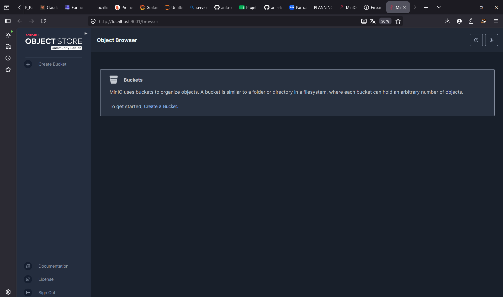
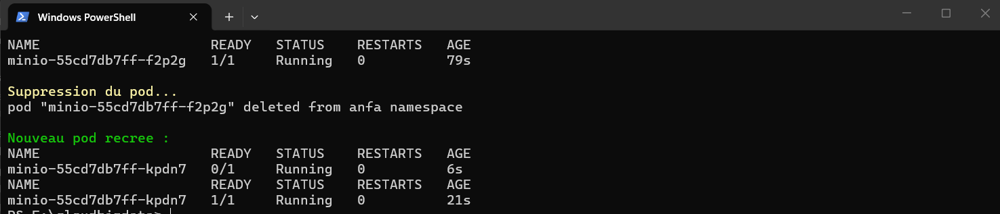
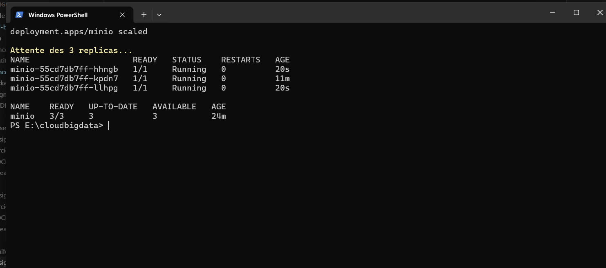

# Rendu Séance 3

**Nom et prénom :** TCHAGBA Kaled  
**Identifiant GitHub :** kaltchagba  
**Professeur :** M. AKPAGNONITE  
**Date de soumission :** 26/06/2026

---

## Résumé de la séance

Cette séance m'a fait franchir un seuil conceptuel important : passer de Docker — où l'on pilote directement des conteneurs sur une machine — à Kubernetes, où l'on déclare un état souhaité et c'est le cluster qui se charge d'y converger et d'y rester. J'ai installé Kind (Kubernetes IN Docker), qui simule un vrai cluster en faisant tourner les nœuds comme des conteneurs Docker sur mon poste. J'ai créé un cluster nommé `anfa` avec `kindest/node:v1.35.1`, configuré un namespace dédié, puis déployé MinIO en trois manifestes YAML distincts : un PVC pour réclamer 2 Gi de stockage persistant, un Deployment pour décrire le pod et garantir sa survie, et un Service NodePort pour lui donner une adresse réseau stable accessible depuis l'extérieur du cluster via `kubectl port-forward`.

Ce qui m'a le plus frappé, c'est la rupture avec l'approche impérative de Docker. Avec `docker run`, on dit *quoi faire* et le daemon exécute. Avec Kubernetes, on dit *ce qu'on veut* — 1 replica de MinIO, 2 Gi de stockage — et le système boucle en permanence pour s'assurer que la réalité correspond à ce désir. J'ai pu le vérifier deux fois de suite : en supprimant manuellement le pod (`kubectl delete pod`), un nouveau a été recréé automatiquement en 21 secondes sans que j'aie rien à faire ; en changeant `replicas: 3` via `kubectl scale`, trois pods sont apparus quasi simultanément. La différence avec Docker Compose est nette : Compose exécute des instructions, Kubernetes maintient un contrat.

---

## Étapes principales

1. **Installation de Kind v0.32.0 et kubectl** — `winget install Kubernetes.kind` ; vérification avec `kind version` et `kubectl version --client`.
2. **Création du cluster `anfa`** — `kind create cluster --name anfa --image kindest/node:v1.35.1` ; vérification avec `kubectl cluster-info --context kind-anfa`.
3. **Namespace et contexte par défaut** — `kubectl create namespace anfa` puis `kubectl config set-context --current --namespace=anfa` pour que toutes les commandes ciblent automatiquement le bon namespace.
4. **Application des 3 manifestes dans l'ordre** — d'abord le PVC (`minio-pvc.yaml`), puis le Deployment (`minio-deployment.yaml`), enfin le Service (`minio-service.yaml`). Le PVC passe immédiatement en `Bound` (StorageClass `standard` de Kind provisionne automatiquement). Le pod atteint `READY 1/1` après environ 20 secondes (temps de démarrage MinIO + readinessProbe).
5. **Accès à la console MinIO** — `kubectl port-forward service/minio 9001:9001` dans un terminal dédié, puis connexion sur `http://localhost:9001` avec les identifiants `anfa-admin` / `anfa-password-2026`.
6. **Self-healing** — `kubectl delete pod <nom>` ; observation de la recréation automatique avec `kubectl get pods` : nouveau pod `1/1 Running` en 21 secondes, même suffixe aléatoire différent.
7. **Scaling horizontal** — `kubectl scale deployment minio --replicas=3` ; les 3 pods atteignent `1/1 Running` en moins de 20 secondes. Retour à 1 replica avec `kubectl scale deployment minio --replicas=1`.

---

## Captures d'écran

### Console MinIO accessible via port-forward



### Self-healing : pod recréé automatiquement après suppression



### Scaling à 3 replicas



---

## Difficultés rencontrées

### 1. Kind non installé — `kind : command not found`

La première tentative de `kind create cluster` a échoué immédiatement : la commande `kind` n'existait pas. Kind ne fait partie ni de kubectl, ni de Docker Desktop, ni d'aucun package cloud standard — c'est un outil indépendant à installer séparément. La version est également critique : pour utiliser `kindest/node:v1.35.1`, Kind doit être en v0.32.0 minimum. Avec une version antérieure, le cluster échoue à démarrer avec une erreur de compatibilité d'image. Solution : `winget install Kubernetes.kind` installe directement la dernière version stable.

### 2. Pod `Running` mais `READY 0/1` — le port-forward échoue prématurément

Dès que le pod est apparu en `Running`, j'ai voulu lancer `kubectl port-forward` pour accéder à la console. Le tunnel s'ouvrait mais toute requête HTTP échouait avec `Connection refused`. La cause : `Running` signifie que le conteneur a démarré, pas que l'application est prête. Le Deployment configure une `readinessProbe` qui interroge `/minio/health/ready` sur le port 9000 avec un `initialDelaySeconds: 10` et un `periodSeconds: 10`. Kubernetes ne route aucun trafic vers un pod tant que cette probe n'est pas verte. Il faut attendre `READY 1/1` — visible avec `kubectl get pods -w` — avant de lancer le port-forward. Ce comportement illustre l'utilité des probes : elles protègent les utilisateurs d'une application partiellement démarrée.

### 3. Le port-forward se coupe quand la fenêtre se ferme

`kubectl port-forward` est un processus foreground : il vit et meurt avec le terminal qui l'a lancé. En fermant accidentellement la fenêtre PowerShell, le tunnel a disparu et `localhost:9001` a immédiatement renvoyé `ERR_CONNECTION_REFUSED`. La solution est de lancer le port-forward dans un terminal dédié qu'on laisse ouvert, ou en arrière-plan (`Start-Process`). Ce comportement s'explique par la nature du mécanisme : `kubectl port-forward` ouvre une connexion WebSocket vers l'API Server, qui relaie le trafic jusqu'au pod. Fermer le terminal ferme le socket. Contrairement à Docker où `-p 9001:9001` crée une règle iptables persistante sur l'hôte, Kind ne dispose pas de routage direct depuis Windows vers ses nœuds (qui sont des conteneurs Docker dans un réseau interne).

---

## Exercices d'application

### Exercice 1 — QCM conceptuel

**1.1 → B. Kubernetes orchestre des conteneurs sur un cluster de machines, en s'appuyant sur un container runtime.**

Kubernetes n'exécute pas lui-même les conteneurs : il délègue cette responsabilité à un runtime (containerd, CRI-O, Docker Engine selon la configuration). Son rôle propre est l'orchestration — décider sur quel nœud placer chaque pod, surveiller leur état, les réparer si nécessaire, gérer les montées en charge. C'est cette séparation des responsabilités qui le rend portable entre infrastructure bare-metal, cloud privé et cloud public.

**1.2 → B. etcd**

etcd est une base de données clé-valeur distribuée qui constitue la mémoire centrale du cluster. Tout objet Kubernetes — Pod, Deployment, Service, PVC — est persisté dans etcd sous forme de document JSON. L'API Server est le seul composant autorisé à lire et écrire dans etcd ; les autres composants (Scheduler, Controller Manager) passent tous par lui. Si etcd est perdu sans sauvegarde, le cluster perd la connaissance de tout ce qu'il devait maintenir.

**1.3 → C. Scheduler**

Le Scheduler est le composant qui observe en continu la liste des pods en attente d'assignation (ceux qui n'ont pas encore de `nodeName` dans leur spec) et choisit le nœud le plus adapté pour chacun, en tenant compte des ressources disponibles, des taints/tolerations et des règles d'affinité. Il ne crée ni ne démarre les pods — il se contente de les affecter à un nœud ; c'est le kubelet de ce nœud qui prend ensuite la main.

**1.4 → C. À l'API Server, qui est le point d'entrée unique du cluster.**

kubectl est un client REST qui sérialise toutes les opérations en requêtes HTTP(S) vers l'API Server (`kubectl get pods` → `GET /api/v1/namespaces/anfa/pods`). C'est le seul point d'entrée du control plane : ni etcd, ni le Scheduler, ni le Controller Manager ne sont accessibles directement depuis l'extérieur. Cette centralisation permet l'authentification, l'autorisation (RBAC) et l'audit sur chaque opération.

**1.5 → B. Le Deployment recrée immédiatement un nouveau pod pour respecter l'état souhaité.**

C'est le self-healing, et on l'a vérifié en direct : après `kubectl delete pod minio-55cd7db7ff-9rvr9`, le Controller Manager a détecté l'écart entre l'état souhaité (1 replica) et l'état observé (0 pod) et a immédiatement créé `minio-55cd7db7ff-rwrkk` — en 21 secondes. Le pod est recréé par le contrôleur Deployment, pas par un redémarrage du même conteneur : c'est une création ex nihilo d'un nouveau pod, avec un nouveau nom.

**1.6 → B. NodePort**

`ClusterIP` est le type par défaut — il attribue une IP virtuelle uniquement routable depuis l'intérieur du cluster, invisible depuis l'hôte. `LoadBalancer` provisionne un load balancer externe (nécessite un fournisseur cloud ou MetalLB). `NodePort` expose le service sur un port statique (entre 30000 et 32767) sur chaque nœud du cluster, ce qui le rend joignable depuis l'extérieur sans infrastructure cloud — c'est le type qu'on a utilisé pour MinIO (ports 30900 et 30901).

**1.7 → B. Elle modifie l'état souhaité du Deployment à 5 replicas ; Kubernetes converge vers ce nombre.**

`kubectl scale` ne contacte pas directement les nœuds pour démarrer des pods : elle envoie une requête PATCH à l'API Server pour mettre à jour le champ `spec.replicas` du Deployment dans etcd. Le Controller Manager détecte aussitôt l'écart (état observé : 1 pod, état souhaité : 5) et crée 4 pods supplémentaires. Si la charge diminue et qu'on scale à 1, c'est le même mécanisme en sens inverse — 4 pods sont terminés.

**1.8 → B. À isoler logiquement les ressources (séparation par équipe, environnement, ou application).**

Un Namespace est une frontière logique à l'intérieur d'un cluster physique. Les ressources d'un namespace (pods, services, PVC…) ne sont pas visibles par défaut dans un autre namespace. Cela permet de faire cohabiter sur un même cluster : l'environnement de production (`prod`), de staging (`staging`), et plusieurs équipes (`team-a`, `team-b`), avec des quotas de ressources et des droits d'accès distincts pour chacun.

**1.9 → B. Des conteneurs Docker.**

Kind (Kubernetes IN Docker) crée des nœuds de cluster sous forme de conteneurs Docker sur la machine hôte. Chaque conteneur embarque un kubelet, un container runtime (containerd) et simule un vrai nœud Kubernetes. C'est visible avec `docker ps` : on y trouve un conteneur nommé `anfa-control-plane`. Cette architecture permet de créer un cluster Kubernetes complet en quelques secondes sur un laptop, sans VM ni accès cloud.

---

### Exercice 2 — Lecture et interprétation d'un manifeste

**2.1 — Rôle de `selector.matchLabels` et `template.metadata.labels`**

`selector.matchLabels: {app: anfa-api}` dit au Deployment *quels pods il doit gérer* : il surveille en permanence tous les pods portant ce label et s'assure qu'il en existe exactement `replicas`. `template.metadata.labels: {app: anfa-api}` définit les labels que porteront les pods créés par ce Deployment. Les deux champs doivent correspondre exactement : si le template crée des pods avec `app: foo` mais que le selector cherche `app: anfa-api`, le Deployment ne les reconnaît pas comme siens et le contrôleur tourne à vide. Kubernetes valide cette correspondance à l'application du manifeste et rejette le Deployment si les labels ne correspondent pas.

**2.2 — Nombre de pods créés et comportement en cas de mort**

`replicas: 2` implique 2 pods simultanément actifs. Si l'un disparaît (crash, nœud défaillant, suppression manuelle), le Controller Manager détecte immédiatement l'écart : état observé = 1, état souhaité = 2. Il crée aussitôt un nouveau pod pour revenir à 2 — exactement le self-healing qu'on a observé avec MinIO. L'avantage de `replicas: 2` sur `replicas: 1` est qu'il n'y a aucune interruption pendant la recréation : le second pod continue de servir les requêtes pendant que le remplaçant démarre.

**2.3 — Pourquoi `minio` comme endpoint suffit**

Dans Kubernetes, chaque Service crée automatiquement une entrée DNS via CoreDNS (le résolveur DNS interne du cluster). Le nom `minio` se résout en `minio.<namespace>.svc.cluster.local`, soit l'IP ClusterIP du Service `minio` dans le même namespace `anfa`. Tant que les deux déploiements vivent dans le même namespace, le nom court `minio` suffit sans préciser le FQDN complet. C'est le même principe qu'en séance 2 où Jupyter joignait MinIO via `http://minio:9000` dans le réseau Docker Compose.

**2.4 — Conséquence de l'absence de Service**

Sans Service, `anfa-api` est totalement isolé du reste. Depuis l'extérieur du cluster : impossible d'y accéder. Depuis l'intérieur du cluster (ex : un autre pod) : les pods ont des IP éphémères attribuées à la création et qui changent à chaque recréation — impossible de s'y fier. Un Service fournit une IP virtuelle stable (ClusterIP) qui reste constante même si les pods derrière changent, et un enregistrement DNS constant (`anfa-api.anfa.svc.cluster.local`) qui masque complètement la dynamique du cycle de vie des pods.

**2.5 — Manifeste Service ClusterIP pour anfa-api**

```yaml
apiVersion: v1
kind: Service
metadata:
  name: anfa-api
  namespace: anfa
spec:
  type: ClusterIP
  selector:
    app: anfa-api
  ports:
    - name: http
      port: 80
      targetPort: 8000
```

`ClusterIP` suffit ici si l'accès externe passe par un Ingress (ou un autre Service de type LoadBalancer en amont). Le `selector: app: anfa-api` doit correspondre exactement aux labels des pods du Deployment. `port: 80` est l'adresse visible côté client ; `targetPort: 8000` est le port réel du conteneur.

---

### Exercice 3 — Diagnostic

**3.1 — Le pod qui ne démarre pas (`ImagePullBackOff`)**

**a. Ce que signifie `ImagePullBackOff` :**
Kubernetes a tenté de télécharger l'image spécifiée depuis le registre Docker (Docker Hub par défaut) et a échoué. Pour ne pas surcharger le registre, il retente avec un délai exponentiel croissant (1s, 2s, 4s, 8s…) — c'est le "backoff". Le pod reste bloqué dans cet état jusqu'à correction ou timeout.

**b. Cause précise :**
La typo `minio/miniooo:latest` — trois `o` au lieu de deux. Cette image n'existe pas sur Docker Hub ; le pull renvoie une erreur 404 du registre. Le nom correct est `minio/minio:latest`.

**c. Commande de diagnostic :**
`kubectl describe pod minio-7d9f8b6c5-x2k9p` — la section `Events` affiche le message exact : `Failed to pull image "minio/miniooo:latest": rpc error: ... not found`. C'est toujours la section `Events` de `describe` qui donne le détail exploitable, pas le simple `kubectl get pods`.

---

**3.2 — Le PVC qui reste en `Pending`**

**a. Ce que signifie `Pending` pour un PVC :**
Kubernetes a enregistré la demande de stockage mais n'a pas encore trouvé de PersistentVolume (PV) capable de la satisfaire — bonne capacité, bon mode d'accès, bonne StorageClass. Le PVC attend indéfiniment jusqu'à ce qu'un PV correspondant soit disponible ou provisionné.

**b. Cause précise :**
`storage: 500Gi` dépasse très largement ce que le provisioner `standard` de Kind peut allouer sur le disque de l'hôte. Kind utilise un provisioner local qui crée des PV à partir de répertoires sur le disque — si l'hôte n'a pas 500 Gi libres (ou si la politique de quotas du StorageClass l'interdit), le PV ne sera jamais créé et le PVC restera `Pending`.

**c. Commande de diagnostic :**
`kubectl describe pvc data-pvc` — la section `Events` contiendra un message du type `no persistent volumes available for this claim and no storage class is set` ou une erreur du provisioner indiquant l'impossibilité d'allouer la capacité demandée. Corriger : réduire `storage` à une valeur réaliste (ex : `2Gi`).

---

**3.3 — Le port-forward qui échoue (`error: pod not running`)**

**a. Pourquoi le port-forward échoue sur un pod `Pending` :**
`kubectl port-forward` ouvre un tunnel TCP vers un pod *en cours d'exécution*. Si le pod est `Pending`, aucun processus conteneur n'existe encore sur aucun nœud — il n'y a rien à qui se connecter. La commande échoue immédiatement avec `error: pod not running`.

**b. Commandes pour diagnostiquer le blocage en `Pending` :**
`kubectl describe pod <nom>` (section `Events`) révèle la raison : nœud sans ressources suffisantes (`Insufficient cpu`), image introuvable, PVC non bound, taint non toléré. Alternativement : `kubectl get events --sort-by='.lastTimestamp' -n anfa` pour voir tous les événements récents du namespace triés chronologiquement.

**c. Ordre logique des opérations :**
1. `kubectl apply -f manifests/` — appliquer les ressources
2. `kubectl get pods -w` — attendre le statut `Running`
3. Vérifier `READY 1/1` (les probes sont vertes)
4. Seulement alors : `kubectl port-forward service/minio 9001:9001`

---

### Exercice 4 — De Docker Compose à Kubernetes

**4.1 — Nombre et rôle des manifestes Kubernetes nécessaires**

3 manifestes distincts sont nécessaires, chacun représentant une responsabilité séparée :

| Manifeste | Objet K8s | Équivalent Compose | Rôle |
|---|---|---|---|
| `minio-pvc.yaml` | PersistentVolumeClaim | `volumes: minio-data` | Demande formelle de stockage persistant, découplée du cycle de vie du pod. |
| `minio-deployment.yaml` | Deployment | Définition du service | Décrit le pod (image, env, ports, volume monté), garantit le nombre de replicas et le self-healing. |
| `minio-service.yaml` | Service | `ports:` | Adresse réseau stable (ClusterIP + DNS), exposition externe via NodePort. |

La séparation en 3 fichiers n'est pas qu'organisationnelle : chaque objet a son propre cycle de vie. On peut mettre à jour le Deployment (nouvelle image) sans toucher au PVC ni au Service.

**4.2 — Volume Docker nommé vs PersistentVolumeClaim**

Un volume Docker nommé est une abstraction locale : Docker le crée sur le système de fichiers de l'hôte et le lie au daemon Docker de cette machine. Si le conteneur est recréé sur le même hôte, les données sont là ; si la machine change, les données ne suivent pas.

Un PVC Kubernetes est une abstraction découplée de l'infrastructure : il exprime un *besoin* (2 Gi, mode `ReadWriteOnce`) sans spécifier *comment* ce besoin sera satisfait. Un StorageClass choisit le backend adapté — SSD local sur un cluster baremetal, EBS sur AWS, Persistent Disk sur GCP — en fonction de l'environnement. On peut passer du laptop au cloud sans modifier un seul YAML d'application : seule la StorageClass change.

**4.3 — Pourquoi `kubectl port-forward` avec Kind plutôt qu'accès direct**

Avec Docker Compose, `ports: "9001:9001"` crée une règle NAT directement sur l'hôte via iptables/netsh : `localhost:9001` est immédiatement accessible depuis n'importe quel navigateur.

Avec Kind, les nœuds sont des conteneurs Docker dans un réseau bridge interne (`172.18.0.0/16` par défaut). Les NodePorts (30900, 30901) sont exposés sur l'interface réseau de ces conteneurs-nœuds, pas sur `localhost` de l'hôte Windows. `kubectl port-forward` crée un tunnel WebSocket via l'API Server qui relaie le trafic jusqu'au pod — c'est la seule façon d'atteindre le service depuis l'hôte sans reconfigurer Kind à la création (`extraPortMappings`).

**4.4 — Deux apports concrets de Kubernetes observés en TP**

1. **Self-healing automatique et permanent :** En supprimant le pod `minio-55cd7db7ff-9rvr9` avec `kubectl delete pod`, un nouveau pod `minio-55cd7db7ff-rwrkk` a été recréé automatiquement en 21 secondes, sans aucune commande supplémentaire. Docker Compose ne monitore pas les conteneurs arrêtés (sauf `restart: always`, qui agit seulement sur le même hôte et ne gère pas la planification sur un cluster).

2. **Scaling déclaratif en une commande :** `kubectl scale deployment minio --replicas=3` a créé 2 pods supplémentaires, tous en `1/1 Running` en moins de 20 secondes. Le Deployment maintient ce nombre — si un des 3 pods meurt, le contrôleur en recrée un immédiatement. Docker Compose n'a pas ce mécanisme d'état souhaité maintenu en continu : `docker compose scale` est une action ponctuelle, pas un contrat.

---

### Exercice 5 — Mini-cas d'architecture

**5.1 — Types d'objets Kubernetes adaptés**

| Composant | Type K8s | Justification |
|---|---|---|
| `pipeline-anfa` | **CronJob** | Job planifié toutes les nuits à 2h, durée ~15 min, terminaison propre attendue. CronJob crée un Job selon le planning cron et nettoie les anciens Jobs selon `successfulJobsHistoryLimit`. |
| `anfa-api` | **Deployment** | Service HTTP long-running, doit répondre aux requêtes mobiles 24h/24. Le Deployment garantit le nombre de replicas, gère les rolling updates sans coupure, et s'intègre nativement avec l'HPA. |
| `anfa-dashboard` | **Deployment** | Service long-running à usage interne (3–4 utilisateurs). Même mécanique que `anfa-api` à moindre échelle ; 1–2 replicas suffisent, pas d'HPA nécessaire. |

**5.2 — Paramètres HPA pour anfa-api**

```yaml
minReplicas: 2
maxReplicas: 10
targetCPUUtilizationPercentage: 70
```

Raisonnement : la charge varie d'un facteur 10 (5 req/s → 50 req/s), d'où `maxReplicas: 10`. `minReplicas: 2` (et non 1) garantit la haute disponibilité en creux — si un pod tombe pendant une période calme, le second continue de servir les requêtes sans interruption, et l'HPA a le temps de réagir avant un pic. Le seuil à 70 % de CPU laisse une marge de 30 % avant saturation et déclenche le scale-out suffisamment tôt pour que les nouveaux pods soient `Ready` avant l'engorgement.

**5.3 — Type de Service pour anfa-api**

**LoadBalancer.** `anfa-api` est exposée à des applications mobiles depuis internet — il faut une IP publique stable et un load balancer qui distribue le trafic entrant sur les replicas. Dans un cluster cloud managé (GKE, EKS, AKS), `type: LoadBalancer` provisionne automatiquement le load balancer du fournisseur et lui attribue une IP publique. `ClusterIP` serait invisible depuis internet ; `NodePort` exposerait directement les nœuds (IPs instables, ports non standards, pas de TLS termination intégrée) — inadapté à une production mobile.

**5.4 — Rolling Update lors d'une mise à jour de `anfa-api`**

Kubernetes applique une stratégie **RollingUpdate** par défaut. Avec `maxUnavailable: 0, maxSurge: 1` :

1. Un nouveau pod v2 est créé *en plus* des pods v1 existants (`maxSurge: 1`).
2. Kubernetes attend que ce pod passe sa `readinessProbe` et soit `READY`.
3. Un pod v1 est alors terminé proprement (`maxUnavailable: 0` garantit qu'aucun pod actif n'est supprimé avant qu'un remplaçant soit prêt).
4. Ce cycle se répète jusqu'à ce que tous les pods tournent sur v2.

Résultat : les utilisateurs mobiles ne voient aucune coupure — à aucun moment le cluster n'est en capacité réduite. Si la readinessProbe de v2 échoue (bug dans la nouvelle image), le déploiement se fige et les pods v1 continuent de servir le trafic.

**5.5 — Manifestes pour anfa-api et pipeline-anfa**

*Deployment anfa-api :*

```yaml
apiVersion: apps/v1
kind: Deployment
metadata:
  name: anfa-api
  namespace: anfa
spec:
  replicas: 3
  strategy:
    type: RollingUpdate
    rollingUpdate:
      maxUnavailable: 0
      maxSurge: 1
  selector:
    matchLabels:
      app: anfa-api
  template:
    metadata:
      labels:
        app: anfa-api
    spec:
      containers:
        - name: api
          image: anfa/api:v1
          ports:
            - name: http
              containerPort: 8000
          env:
            - name: MINIO_ENDPOINT
              value: "http://minio:9000"
          readinessProbe:
            httpGet:
              path: /health
              port: 8000
            initialDelaySeconds: 5
            periodSeconds: 10
          resources:
            requests:
              cpu: "100m"
              memory: "128Mi"
            limits:
              cpu: "500m"
              memory: "512Mi"
```

*CronJob pipeline-anfa :*

```yaml
apiVersion: batch/v1
kind: CronJob
metadata:
  name: pipeline-anfa
  namespace: anfa
spec:
  schedule: "0 2 * * *"
  concurrencyPolicy: Forbid
  successfulJobsHistoryLimit: 3
  failedJobsHistoryLimit: 1
  jobTemplate:
    spec:
      template:
        spec:
          restartPolicy: OnFailure
          containers:
            - name: pipeline
              image: anfa/pipeline:v1
              env:
                - name: MINIO_ENDPOINT
                  value: "http://minio:9000"
                - name: DATE_TRAITEMENT
                  value: "auto"
              resources:
                requests:
                  cpu: "200m"
                  memory: "256Mi"
                limits:
                  cpu: "1000m"
                  memory: "1Gi"
```

`concurrencyPolicy: Forbid` empêche deux exécutions simultanées si le pipeline précédent a dépassé 24h. `restartPolicy: OnFailure` (et non `Always`) garantit que le Job retente en cas d'erreur mais ne boucle pas indéfiniment sur un succès.
