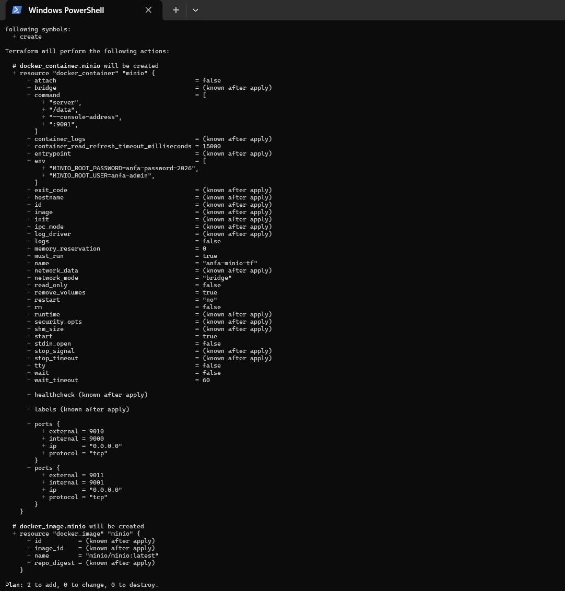
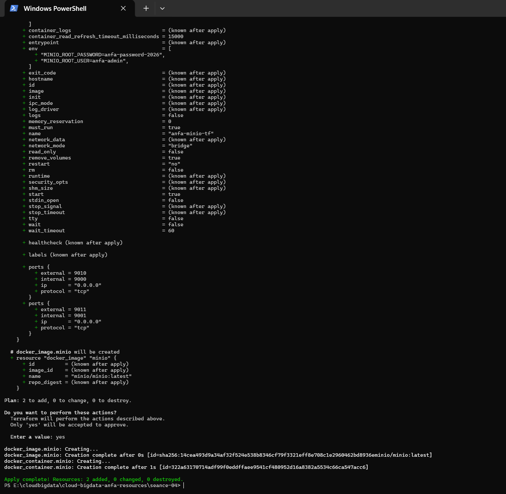
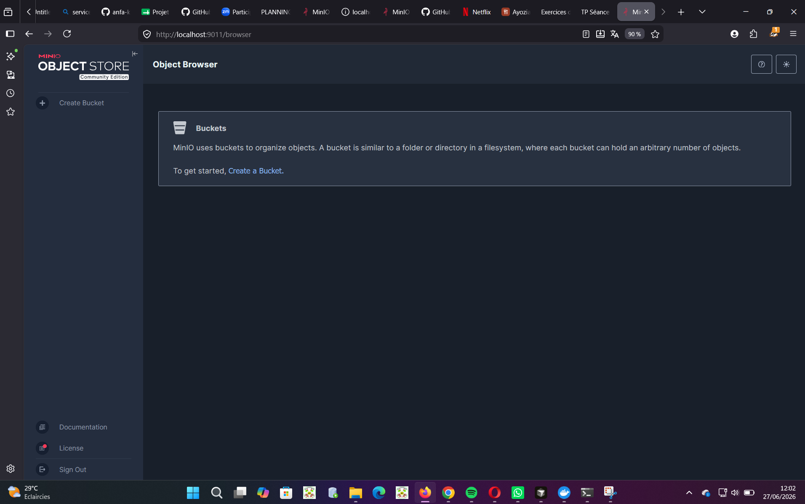
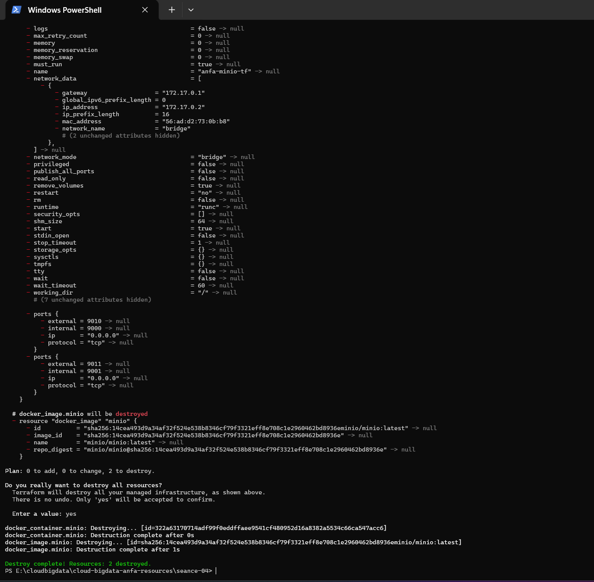

# Rendu Séance 4

**Nom et prénom :** TCHAGBA Kaled  
**Identifiant GitHub :** kaltchagba  
**Professeur :** M. AKPAGNONITE  
**Date de soumission :** 27/06/2026

---

## Résumé de la séance

Pour la première fois, j'ai créé un conteneur MinIO sans écrire une seule commande `docker run`. Tout passe par un fichier HCL que Terraform lit, planifie, puis exécute. Le truc qui m'a surpris c'est le `terraform plan` : avant de faire quoi que ce soit, Terraform te montre exactement ce qu'il va faire — créer, modifier, détruire. Ce réflexe de lire le plan avant d'appuyer sur `yes` s'installe très vite.

J'ai aussi compris pourquoi le `terraform.tfstate` ne doit jamais aller sur GitHub : en l'ouvrant, on voit les mots de passe en clair dans le JSON. La seconde partie du TP, sur les variables et le `.tfvars`, règle ce problème proprement. Au final j'ai une stack complète (réseau + volume + conteneur MinIO) décrite en code, versionnable et reproductible sur n'importe quelle machine avec Docker.

---

## Étapes principales

1. Installation de Terraform via `winget install HashiCorp.Terraform` — vérification avec `terraform version` → `Terraform v1.15.7`.
2. Écriture d'un `main.tf` minimal : provider Docker, image MinIO, conteneur `anfa-minio-tf` sur les ports 9010/9011.
3. `terraform init` → téléchargement du provider `kreuzwerker/docker` ; `terraform plan` → visualisation du plan ; `terraform apply` → création du conteneur ; `terraform destroy` → suppression propre.
4. Observation du fichier `terraform.tfstate` et test de l'idempotence : un deuxième `terraform apply` sans changement affiche `No changes`.
5. Mise en place du `.gitignore` Terraform pour protéger les fichiers sensibles.
6. Stack complète : ajout d'un réseau `anfa-network` et d'un volume `anfa-minio-data-tf` dans `main.tf`.
7. Refactoring avec `variables.tf`, `terraform.tfvars` (secret, non commité) et `terraform.tfvars.example` (modèle commité). `terraform plan` confirme `No changes`.

---

## Captures d'écran

### terraform plan — création initiale



### terraform apply réussi



### Console MinIO créée par Terraform



### terraform destroy



---

## Difficultés rencontrées

### 1. Terraform non installé et PATH non rechargé

`terraform` était introuvable après l'installation. La commande s'installe bien mais le PATH de la session PowerShell en cours n'est pas mis à jour automatiquement. Il faut le recharger manuellement ou ouvrir un nouveau terminal. Pas bloquant mais ça prend quelques minutes à comprendre la première fois.

### 2. Conflit de ports — 9000/9001 déjà utilisés

Mon premier réflexe a été d'utiliser les ports 9000/9001 habituels. Terraform a renvoyé une erreur `port is already allocated` parce qu'un conteneur MinIO de la séance 3 tournait encore. Le TP prévoit 9010/9011 exprès pour ça. C'est aussi la raison pour laquelle ces ports sont des variables : on peut changer d'environnement sans toucher au code.

### 3. `terraform.tfstate` qui apparaît dans `git status`

En préparant le commit, j'ai vu `terraform.tfstate` dans `git status` et j'allais le stager avec le reste. En l'ouvrant par curiosité, le mot de passe MinIO était lisible en clair dans le JSON. La mise en place du `.gitignore` avec `*.tfstate`, `*.tfvars` et `!*.tfvars.example` a réglé le problème. Sans ce `.gitignore`, les credentials auraient fini sur GitHub.

---

## Exercices d'application

### Exercice 1 — QCM conceptuel

**1.1 → B. L'IaC remplace totalement la nécessité de comprendre l'infrastructure sous-jacente.**

C'est la seule affirmation fausse. L'IaC automatise la gestion de l'infra mais ne remplace pas la compréhension : un Terraform mal écrit peut créer des failles ou des ressources mal configurées. Les propositions A, C et D sont vraies.

**1.2 → B. Le déclaratif décrit l'état souhaité ; l'impératif décrit la séquence d'actions à effectuer.**

Terraform est déclaratif : on dit ce qu'on veut, pas comment le faire. Un script bash qui enchaîne `docker network create` puis `docker run` est impératif : chaque étape est explicite et ordonnée à la main.

**1.3 → B. Elle produit le même résultat quel que soit le nombre de fois où elle est appliquée.**

On l'a vérifié : un deuxième `terraform apply` sans changement affiche `No changes. Your infrastructure matches the configuration.` — la ressource n'est pas recréée en double.

**1.4 → B. À fournir un plugin qui sait communiquer avec une API spécifique (AWS, Docker, Kubernetes…).**

Le provider `kreuzwerker/docker` traduit le HCL en appels à l'API du daemon Docker. Sans provider, Terraform ne saurait pas quoi faire de `resource "docker_container"`. Il est téléchargé lors du `terraform init`.

**1.5 → B. Terraform compare le state au code, ne voit aucun écart, et n'effectue aucune action.**

Terraform lit le `terraform.tfstate`, le compare au code HCL, détecte zéro différence et affiche `No changes`. Il ne recrée pas tout et ne plante pas.

**1.6 → C. Mémoriser ce que Terraform a créé pour pouvoir suivre les changements incrémentaux.**

C'est la mémoire de Terraform. Il contient les IDs et attributs de toutes les ressources créées. Sans ce fichier, Terraform ne saurait pas ce qui existe déjà et proposerait de tout recréer.

**1.7 → B. Parce qu'il peut contenir des secrets en clair (mots de passe, clés API) et peut être corrompu par des commits concurrents.**

On l'a vu dans le TP : le mot de passe MinIO apparaît en clair dans le JSON du `terraform.tfstate`. Le pousser sur GitHub expose immédiatement les credentials.

**1.8 → C. terraform plan**

`terraform plan` montre ce que Terraform compte faire sans rien exécuter. C'est l'étape de revue avant l'`apply`. `terraform validate` vérifie seulement la syntaxe, pas ce qui sera réellement créé ou détruit.

**1.9 → B. Un fork open source de Terraform créé après le changement de licence de HashiCorp en 2023.**

HashiCorp a basculé de Mozilla Public License vers BUSL en 2023, restreignant l'usage commercial. La communauté a créé OpenTofu sous licence open source, maintenu par la Linux Foundation. Les deux outils restent largement compatibles syntaxiquement.

**1.10 → B. Non, Terraform provisionne l'infrastructure, Ansible configure des machines existantes — ils sont complémentaires.**

Terraform crée les serveurs, réseaux et volumes. Ansible se connecte ensuite à ces machines pour installer et configurer les logiciels. Les deux s'utilisent ensemble dans la plupart des pipelines de déploiement.

---

### Exercice 2 — Lecture et interprétation d'un fichier Terraform

**2.1 — Les 4 resources définies**

| Resource | Type | Rôle |
|---|---|---|
| `docker_network.back` | `docker_network` | Crée le réseau `anfa-backend` pour isoler les conteneurs. |
| `docker_volume.data` | `docker_volume` | Crée le volume `postgres-data` pour persister les données PostgreSQL. |
| `docker_image.postgres` | `docker_image` | Télécharge l'image `postgres:15` depuis Docker Hub. |
| `docker_container.db` | `docker_container` | Crée le conteneur PostgreSQL avec ses variables, ports, volume et réseau. |

**2.2 — Référence `docker_image.postgres.image_id`**

`docker_image.postgres.image_id` est une référence à l'attribut `image_id` de la resource image, qui contient le digest SHA256 exact de l'image après téléchargement.

Par rapport à écrire directement `image = "postgres:15"` : la référence crée une **dépendance implicite** (Terraform crée l'image avant le conteneur, sans qu'on ait à écrire `depends_on`) et garantit qu'on utilise le digest exact — pas un tag qui peut pointer vers une version différente le lendemain.

**2.3 — Ordre de création lors du premier `terraform apply`**

Terraform analyse le graphe de dépendances et crée :
1. **En parallèle** : `docker_network.back`, `docker_volume.data`, `docker_image.postgres` — aucune dépendance entre eux.
2. **Ensuite** : `docker_container.db` — dépend des trois précédents via ses références. Terraform attend qu'ils soient tous créés avant de démarrer le conteneur.

**2.4 — Problème de sécurité et correction**

`POSTGRES_PASSWORD=secret123` est écrit en clair dans le code, donc dans Git. Solution : variable sensitive avec `terraform.tfvars`.

```hcl
# variables.tf
variable "postgres_password" {
  description = "Mot de passe PostgreSQL"
  type        = string
  sensitive   = true
}

# main.tf — env du conteneur
env = [
  "POSTGRES_DB=anfa",
  "POSTGRES_USER=anfa_user",
  "POSTGRES_PASSWORD=${var.postgres_password}",
]
```

```
# terraform.tfvars (dans .gitignore)
postgres_password = "secret123"
```

**2.5 — Comportement après `destroy` puis modification du port**

Après `terraform destroy`, le state est vide — toute l'infrastructure est supprimée. En relançant `terraform apply` avec `external = 5433`, Terraform repart de zéro et crée les **4 resources** (`Plan: 4 to add`). Il n'y a aucune différence incrémentale à gérer, le changement de port est simplement pris en compte dans la création initiale.

---

### Exercice 3 — Diagnostic

**3.1 — L'apply qui échoue avec une dépendance circulaire**

**a.** `Error: Cycle` signifie que Terraform a détecté une dépendance circulaire : A dépend de B et B dépend de A. Terraform construit un graphe acyclique dirigé pour déterminer l'ordre de création — un cycle dans ce graphe est une impasse.

**b.** Pour créer A, il faut que B existe déjà (pour obtenir son nom). Pour créer B, il faut que A existe déjà. Aucun des deux ne peut être créé en premier — contradiction logique détectée avant même de contacter Docker.

**c.** Briser la dépendance en utilisant des valeurs statiques plutôt que des références dynamiques :

```hcl
resource "docker_container" "a" {
  name  = "container-a"
  image = "alpine"
  env   = ["LINKED_TO=container-b"]  # nom fixe, pas de référence
}

resource "docker_container" "b" {
  name  = "container-b"
  image = "alpine"
  env   = ["LINKED_TO=container-a"]
}
```

---

**3.2 — Le plan qui veut recréer le conteneur**

**a.** Les variables d'environnement d'un conteneur Docker ne sont pas modifiables à chaud. L'attribut `env` est marqué `forces replacement` dans le provider : la seule façon d'appliquer le changement est de supprimer le conteneur et d'en créer un nouveau. D'où le `-/+` (destroy + create) plutôt que `~` (modification en place).

**b.** Les données ne sont **pas perdues**. Le volume `anfa-minio-data-tf` est une resource indépendante du conteneur. Terraform supprime le conteneur mais pas le volume — le nouveau conteneur se rattache au même volume avec toutes ses données intactes.

**c.** En production, la recréation implique une interruption de service : les connexions actives sont coupées le temps du redémarrage. Pour une base de données, ça peut signifier des transactions perdues. Ce genre d'opération doit être planifié pendant une fenêtre de maintenance.

---

**3.3 — Le state corrompu**

**a.** Le `terraform.tfstate` contient les valeurs de toutes les variables, y compris les sensibles, en clair. En le poussant sur GitHub, le mot de passe est immédiatement exposé — potentiellement indexé si le dépôt est public.

**b.** Awa récupère un state qui décrit l'infrastructure d'une autre machine. Quand elle lance `terraform apply`, Terraform compare ce state (qui prétend que des ressources existent avec des IDs précis) à sa propre machine (où ces ressources n'existent pas). Résultat : états incohérents, risque de doubles créations ou de destructions inattendues.

**c.** Utiliser un **remote backend** : Terraform Cloud, S3 + DynamoDB sur AWS, ou le backend HTTP de GitLab. Le state est stocké de façon centralisée, chiffré, avec verrouillage automatique qui empêche deux `apply` simultanés.

---

### Exercice 4 — Adaptation Compose → Terraform

```hcl
terraform {
  required_providers {
    docker = {
      source  = "kreuzwerker/docker"
      version = "~> 3.0"
    }
  }
}

provider "docker" {}

variable "minio_root_password" {
  description = "Mot de passe administrateur MinIO"
  type        = string
  sensitive   = true
}

# Réseau partagé entre les deux services
resource "docker_network" "anfa_net" {
  name = "anfa-network"
}

# Volume persistant MinIO
resource "docker_volume" "minio_data" {
  name = "minio-data"
}

resource "docker_image" "minio" {
  name = "minio/minio:latest"
}

resource "docker_image" "jupyter" {
  name = "jupyter/scipy-notebook:latest"
}

resource "docker_container" "minio" {
  name    = "anfa-minio"
  image   = docker_image.minio.image_id
  command = ["server", "/data", "--console-address", ":9001"]

  ports {
    internal = 9000
    external = 9000
  }
  ports {
    internal = 9001
    external = 9001
  }

  env = [
    "MINIO_ROOT_USER=anfa-admin",
    "MINIO_ROOT_PASSWORD=${var.minio_root_password}",
  ]

  volumes {
    volume_name    = docker_volume.minio_data.name
    container_path = "/data"
  }

  networks_advanced {
    name = docker_network.anfa_net.name
  }

  lifecycle {
    ignore_changes = [log_opts]
  }
}

# Terraform gère automatiquement la dépendance via la référence au réseau —
# pas besoin de depends_on comme dans Compose.
resource "docker_container" "jupyter" {
  name  = "anfa-jupyter"
  image = docker_image.jupyter.image_id

  ports {
    internal = 8888
    external = 8888
  }

  env = [
    "JUPYTER_TOKEN=anfa-token",
  ]

  networks_advanced {
    name = docker_network.anfa_net.name
  }

  lifecycle {
    ignore_changes = [log_opts]
  }
}
```

---

### Exercice 5 — Mini-cas d'architecture

**5.1 — Types de resources Terraform pour l'infrastructure cloud Anfa**

- Un **bucket de stockage objet** (équivalent S3 chez OVHcloud) pour les CSV du référentiel et les logs GPS — données souveraines, restent en Europe.
- Un **cluster Kubernetes managé** pour les traitements Spark avec autoscaling selon la charge.
- Un **réseau privé virtuel** pour isoler les composants internes du trafic public.
- Un **load balancer avec IP publique** pour exposer le dashboard Grafana depuis n'importe quel téléphone.
- Une **base de données managée** (PostgreSQL) pour les métadonnées de la plateforme, avec sauvegardes automatiques.

**5.2 — Un seul `main.tf` de 800 lignes vs plusieurs fichiers séparés**

Je recommande **B — plusieurs fichiers séparés** (`network.tf`, `storage.tf`, `compute.tf`, `monitoring.tf`).

Un fichier de 800 lignes est illisible et génère des conflits Git dès que deux personnes travaillent en parallèle. Avec des fichiers séparés, chacun touche à son périmètre sans interférer avec les autres, les PR sont plus faciles à relire, et retrouver une resource prend quelques secondes. Terraform charge automatiquement tous les `.tf` du dossier — la séparation est purement organisationnelle, sans impact technique.

**5.3 — Deux mécanismes pour gérer dev et prod**

1. **Fichiers `.tfvars` séparés** (`terraform.dev.tfvars`, `terraform.prod.tfvars`) : chaque fichier contient les valeurs propres à son environnement. On applique avec `terraform apply -var-file=terraform.prod.tfvars`.

2. **Workspaces Terraform** (`terraform workspace new dev`, `terraform workspace new prod`) : même code HCL, state séparé par workspace. Les valeurs peuvent varier via des conditions sur `terraform.workspace`.

**5.4 — Migration OVHcloud → AWS : triviale ou coûteuse ?**

La migration ne sera pas triviale, mais pas non plus un repartir de zéro. Ce qui reste : la structure HCL, les variables, les outputs, les modules, les fichiers `.tfvars`. Ce qui change : chaque resource doit être réécrite avec les types propres à AWS (`aws_s3_bucket` à la place du bucket OVH, `aws_eks_cluster` à la place du cluster OVH, etc.). Il faut aussi reconfigurer l'authentification et potentiellement migrer le state vers un nouveau backend. Sur une infrastructure de taille moyenne, compter plusieurs jours à quelques semaines selon la complexité.

**5.5 — Trois bonnes pratiques pour une équipe de 4 personnes**

1. **Remote backend avec verrouillage** (Terraform Cloud ou S3 + DynamoDB) : un seul state partagé, chiffré, avec verrou automatique pour éviter deux `apply` simultanés.

2. **`.gitignore` strict dès le premier commit** : exclure `*.tfstate`, `*.tfvars` et `.terraform/` avant que quelqu'un ne les commite par erreur. Une fois des secrets dans l'historique Git, les effacer vraiment est compliqué.

3. **PR obligatoire + `terraform plan` en CI avant tout `apply`** : personne n'applique directement sur la branche principale. Le CI exécute `terraform plan` et affiche le diff dans les commentaires de la PR — l'équipe valide avant de merger.
