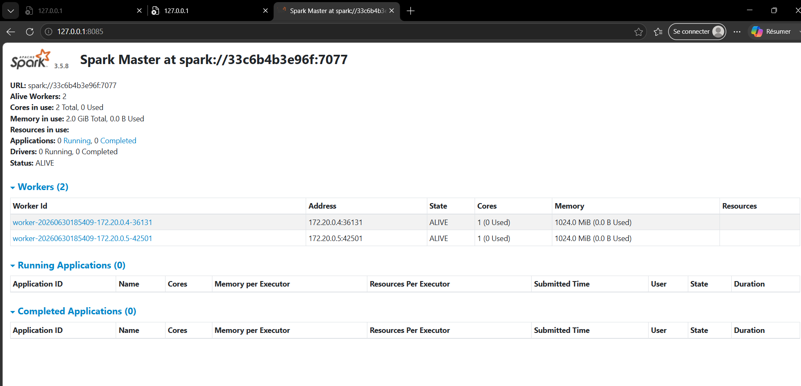
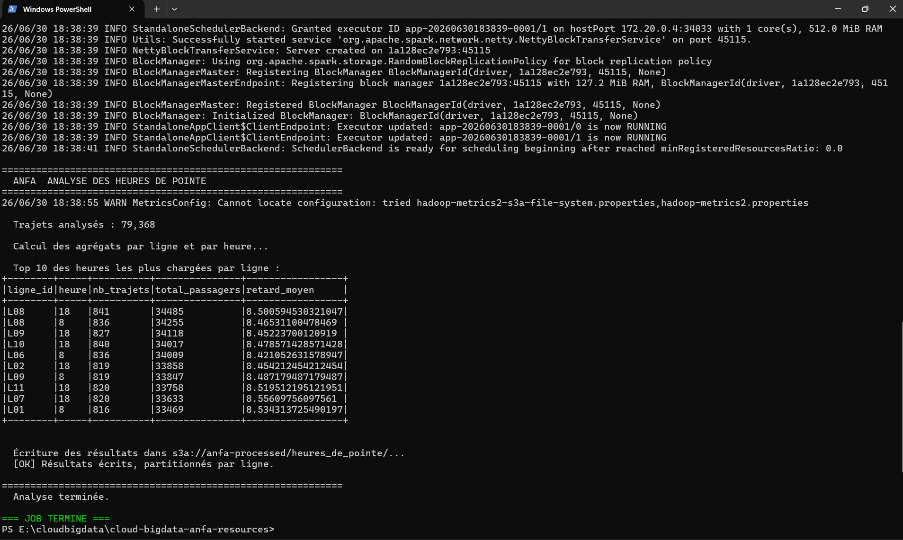
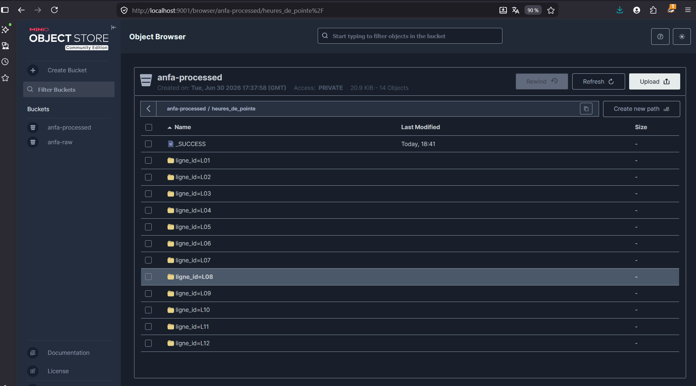

# Rendu Séance 5

**Nom et prénom :** Kaled Tchagba

## Résumé de la séance

J'ai déployé un cluster Spark standalone (1 master + 2 workers) avec Docker Compose, intégré à MinIO pour le stockage objet. J'ai soumis deux jobs PySpark distribués via `spark-submit` : l'un pour analyser le référentiel Anfa (statistiques sur les lignes, arrêts et bus), l'autre pour calculer les heures de pointe à partir d'un historique de 30 jours de trajets simulés. Les résultats ont été écrits en Parquet partitionné dans la zone `anfa-processed`, selon le pattern data lake. J'ai pu observer l'exécution en direct dans le dashboard Spark Master et comparer le ressenti entre le mode local (séance 2) et le mode cluster.

## Étapes principales

1. Déploiement du cluster Spark standalone (1 master + 2 workers) via Docker Compose.
2. Préparation de MinIO : création des buckets `anfa-raw` et `anfa-processed`, compte de service applicatif (`anfa-app-key`).
3. Upload du référentiel Anfa dans MinIO (`anfa-raw/referentiel/`) via `upload_referentiel.py`.
4. Premier job distribué (`analyse_referentiel_cluster.py`) : lecture des 4 CSV depuis MinIO via le connecteur S3A, calcul de statistiques (nb lignes, arrêts, bus actifs, capacité), écriture des résultats en Parquet dans `anfa-processed/bus_par_ligne`.
5. Génération d'un historique simulé de 30 jours de trajets (`generer_trajets.py`) → stocké dans `anfa-raw/trajets/trajets_30j.csv`.
6. Job d'analyse des heures de pointe (`heures_de_pointe.py`) : extraction de l'heure depuis le timestamp, `groupBy` (shuffle), écriture Parquet partitionnée par `ligne_id` dans `anfa-processed/heures_de_pointe/`.
7. Comparaison subjective entre mode local et mode cluster.

## Captures d'écran

### Dashboard Spark Master avec 2 workers

### Application Spark exécutée avec succès

### Résultats du Top 10 dans la console

### Bucket anfa-processed avec heures_de_pointe partitionné

## Réflexion : local vs cluster

Sur ~75 000 trajets, j'ai constaté que le mode cluster n'est pas plus rapide que le mode local — le job a pris environ 35-40 secondes sur le cluster, contre probablement moins en mode `local[*]` directement. C'est tout à fait normal : avec seulement 2 workers sur le même laptop, l'overhead de communication entre le Driver et les Executors coûte plus cher que le gain apporté par le parallélisme.

Ce qui m'a semblé différent entre les deux modes : en mode cluster, on voit clairement dans le dashboard Spark Master les stages se découper en tâches parallèles, on voit les executors s'activer. C'est une autre dimension d'observation qui n'existe pas en mode local.

La règle que je retiens : le mode cluster apporte de la valeur à partir du moment où le volume dépasse les capacités RAM d'une seule machine, ou quand on a des dizaines de workers répartis sur des machines distinctes. Pour des jeux de données qui tiennent en RAM sur un seul nœud (< quelques Go), le mode `local[*]` reste plus rapide et plus simple.

## Note : port 8080

Sur Windows, le service `AgentService` (PID 6492) occupe le port 8080. Le port `8085:8080` a donc été utilisé à la place dans le `docker-compose.yml`. Le dashboard Spark Master est accessible sur http://localhost:8085.

## Bonus Spark sur Kubernetes

Réalisé : non.

## Réponses aux exercices d'application

Les exercices d'application de la séance 5 portent sur la compréhension du cluster Spark, du connecteur S3A et du pattern data lake.

**Pourquoi `.master("spark://spark-master:7077")` à la place de `.master("local[*]")` ?**
En mode `local[*]`, Spark utilise les threads de la machine locale — aucun cluster n'est impliqué. En mode `spark://spark-master:7077`, le Driver contacte le Spark Master qui distribue les tâches sur les Workers réels. C'est la seule différence dans le code : le reste du job PySpark est identique.

**Pourquoi `s3a://` et non `file://` ou `/data/...` pour lire depuis MinIO ?**
Le connecteur S3A est l'implémentation Hadoop du protocole S3 d'Amazon. MinIO étant compatible avec l'API S3, on pointe vers `http://minio:9000` via la configuration `spark.hadoop.fs.s3a.endpoint`. Le schéma `s3a://` dit à Spark d'utiliser ce connecteur pour accéder aux fichiers — le code de lecture reste identique à ce qu'on utiliserait pour AWS S3 en production.

**Qu'est-ce que le pattern data lake (zones raw / processed) ?**
`anfa-raw` reçoit les données brutes telles qu'elles arrivent (CSV du référentiel, fichier de trajets simulé). `anfa-processed` reçoit les résultats des traitements Spark, au format Parquet optimisé, parfois partitionné. Cette séparation garantit que les données brutes sont toujours disponibles pour relancer un traitement, et que les données traitées sont prêtes pour l'analyse ou la BI sans re-calcul.

**Pourquoi l'écriture Parquet partitionnée par `ligne_id` ?**
Partitionner par `ligne_id` crée des sous-dossiers `ligne_id=L01/`, `ligne_id=L02/`… Si une requête ultérieure filtre sur une seule ligne (`WHERE ligne_id = 'L03'`), Spark ne lit que le sous-dossier correspondant — c'est le *partition pruning*. Sur des pétaoctets de données, cela peut faire passer une requête de plusieurs heures à quelques minutes.

## Difficultés rencontrées

Le premier écueil a été le port 8080, occupé par un service Windows (`AgentService`). J'ai dû changer le mapping en `8090:8080` dans le `docker-compose.yml`.

Deuxième point : au premier lancement du `spark-submit` avec `--packages`, Maven télécharge `hadoop-aws` et `aws-java-sdk-bundle` (~275 Mo au total). C'est long sur une connexion lente, et sans l'option `-e HOME=/tmp --conf spark.jars.ivy=/tmp/.ivy2`, le téléchargement échouait parce que l'utilisateur `spark` de l'image n'a pas de répertoire home standard.

Ce que j'ai retenu : en mode cluster, le job PySpark est exactement le même qu'en mode local. Seules les deux lignes de configuration changent (le master et le endpoint S3A). C'est la vraie promesse de portabilité de Spark.
