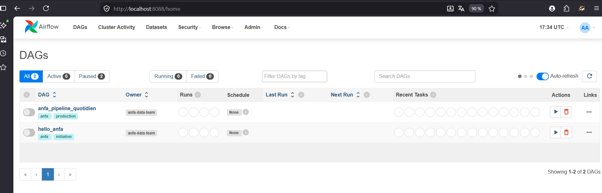
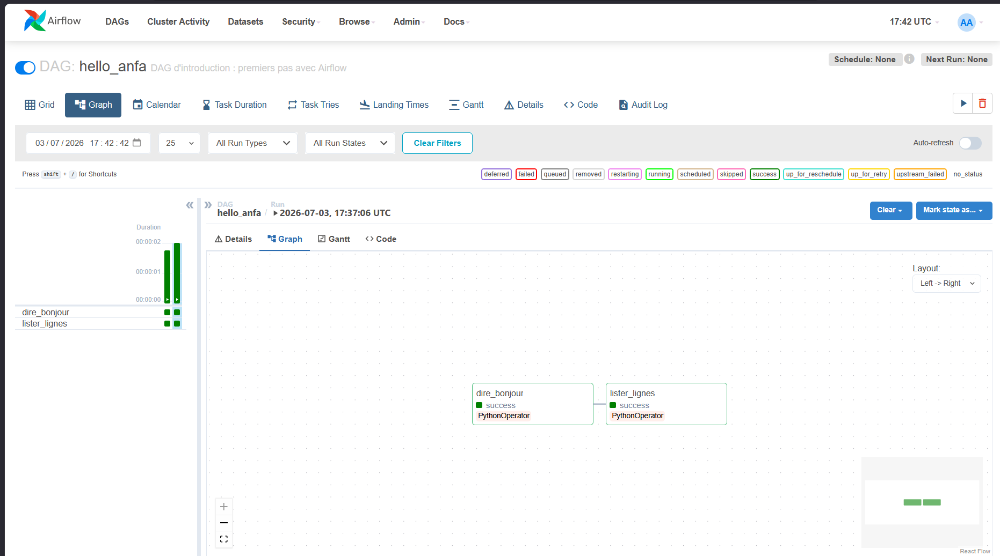
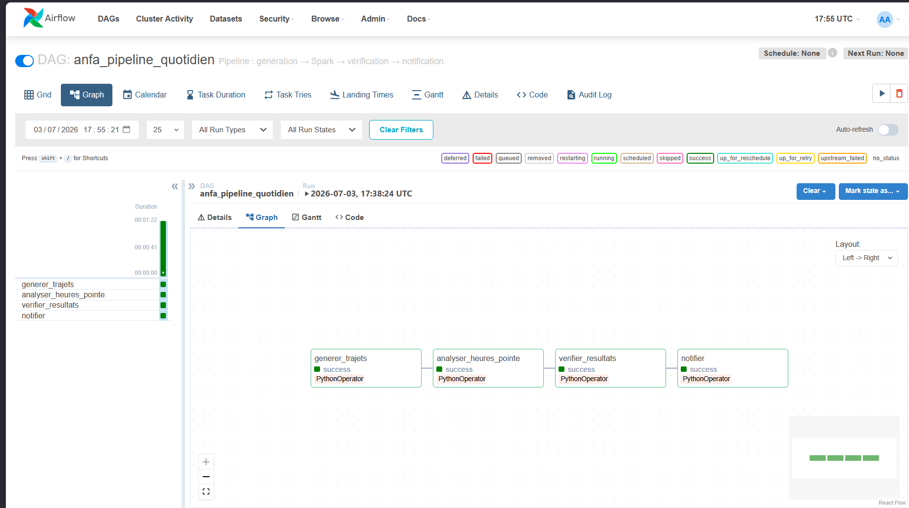
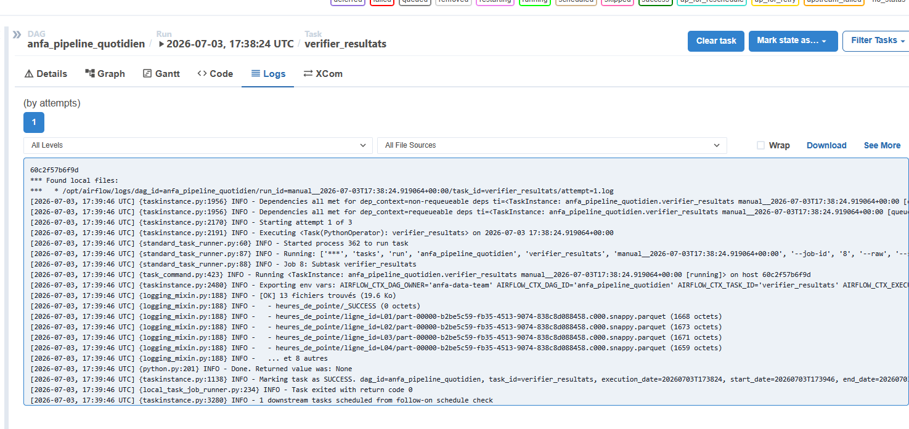
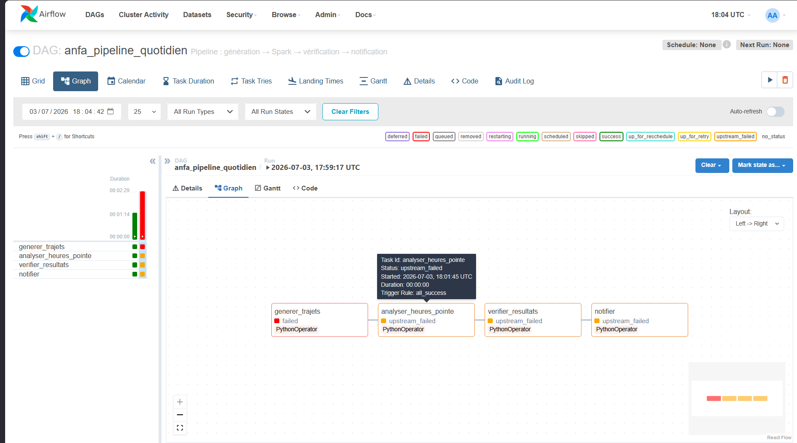

# Rendu Séance 6

**Nom et prénom :** Kaled Tchagba

## Résumé de la séance

J'ai déployé Apache Airflow en mode LocalExecutor aux côtés de MinIO et du cluster Spark
de la séance 5. Un premier DAG simple (`hello_anfa`, 2 tâches) m'a permis de comprendre
la mécanique de base : DAG, opérateur, dépendances, déclenchement manuel. Ensuite, le DAG
métier `anfa_pipeline_quotidien` orchestre le pipeline complet en 4 étapes enchaînées :
génération des trajets → analyse Spark → vérification des résultats dans MinIO →
notification. J'ai aussi provoqué volontairement un échec (MinIO coupé) pour observer le
comportement des retries et la propagation de l'erreur aux tâches en aval
(`upstream_failed`).

## Étapes principales

1. **Correction du port Spark Master** dans `docker-compose.yml` : `8090:8080` → `8085:8080`
   (port 8090 occupé par `WsToastNotification` sur Windows, identique au problème de la séance 5).
2. **Lancement de la stack complète** via `docker compose up -d` depuis `seance-06/` :
   PostgreSQL démarre en premier, `airflow-init` migre la base et crée l'utilisateur admin,
   puis le scheduler et le webserver démarrent.
3. **Initialisation MinIO** : création des buckets `anfa-raw` et `anfa-processed`, ajout du
   compte de service `anfa-app-key` / `anfa-app-secret-2026` avec droits `readwrite`.
4. **DAG `hello_anfa`** : déclenchement manuel depuis l'UI Airflow, succès immédiat des
   2 tâches (`dire_bonjour` → `lister_lignes`). Durée : 2 secondes.
5. **DAG `anfa_pipeline_quotidien`** : les 4 tâches s'enchaînent correctement. Airflow
   soumet le job Spark via le Docker SDK (socket `/var/run/docker.sock` monté dans le
   scheduler) — pas besoin de Java dans l'image Airflow. Durée totale : ~1 min 22 s.
6. **Tâche `verifier_resultats`** : 13 fichiers Parquet trouvés dans `anfa-processed/heures_de_pointe/`,
   partitionnés par `ligne_id` (L01 à L12).
7. **Démonstration des retries** : arrêt de MinIO, re-déclenchement du DAG.
   `generer_trajets` échoue 3 fois (tentative 1 + 2 retries) faute de connexion S3,
   les 3 tâches aval passent en `upstream_failed`.

## Captures d'écran

### UI Airflow après connexion — les 2 DAGs disponibles

### DAG hello_anfa — les 2 tâches en succès (Graph view)

### DAG anfa_pipeline_quotidien — pipeline complet en succès

### Logs de la tâche `verifier_resultats` — 13 fichiers Parquet confirmés

### Retry et propagation d'échec — `generer_trajets` failed, tâches aval upstream_failed

## Réflexion : pourquoi Airflow plutôt qu'un cron ?

Un `cron` lance un script à heure fixe, mais sans aucune visibilité sur ce qui s'est passé :
si le script plante en silence, personne ne le sait. Airflow apporte trois choses que cron
n'a pas.

D'abord, **les dépendances entre tâches** : `analyser_heures_pointe` ne démarre pas si
`generer_trajets` a échoué. Avec un cron, il faudrait coder cette logique à la main dans
chaque script.

Ensuite, **l'observabilité** : chaque exécution a un run_id, chaque tâche a ses propres
logs horodatés, son historique, son statut. La vue Graph montre d'un coup d'œil ce qui
a marché et ce qui a raté.

Enfin, **la robustesse** : les retries automatiques absorbent les pannes réseau transitoires
sans intervention humaine. Sur ce TP, couper MinIO pendant 2 minutes et le relancer aurait
suffi pour que le DAG reparte seul sur une 3ème tentative.

Je l'utiliserais sur un projet réel dès qu'il y a plus de 2 étapes dépendantes, ou dès
qu'un traitement doit s'exécuter à heure fixe avec une garantie de résultat. Pour un
one-shot ou un script de 30 lignes, un cron reste plus simple.

## Difficultés rencontrées

**Port 8090 occupé** sur Windows par le service `WsToastNotification` — le même problème
qu'à la séance 5. Résolu en basculant sur `8085:8080` pour Spark Master.

**Postgres 18 incompatible avec l'ancien volume** : la première tentative de `docker compose up`
a échoué parce que `postgres:18-alpine` change l'emplacement de son répertoire de données
et refuse de démarrer sur un volume créé avec une version précédente. Solution : revenir
sur `postgres:16-alpine` (déjà présent en cache local) et supprimer le volume corrompu
avec `docker compose down -v`.

**Temps d'initialisation d'Airflow** : le webserver installe `boto3` et `docker` au
démarrage via `pip install`. Sur la première exécution, cela prend 60 à 90 secondes
supplémentaires pendant lesquelles l'UI n'est pas encore disponible. Il faut attendre
le `healthy` avant de tenter de se connecter.
