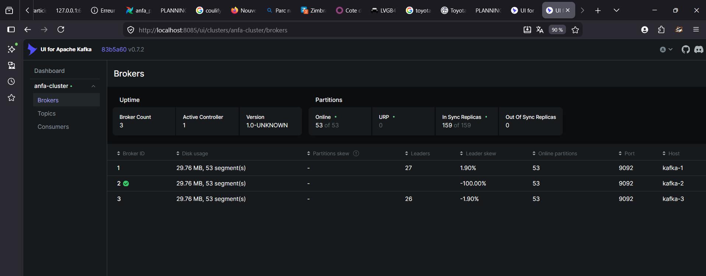
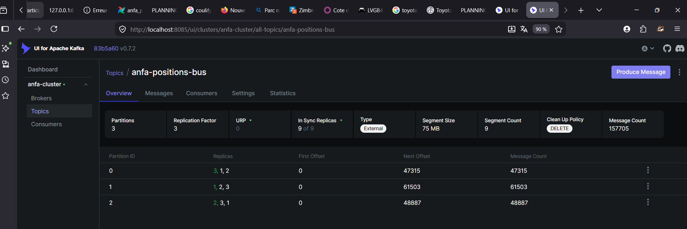
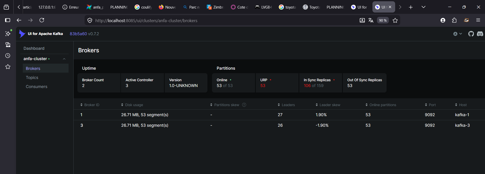
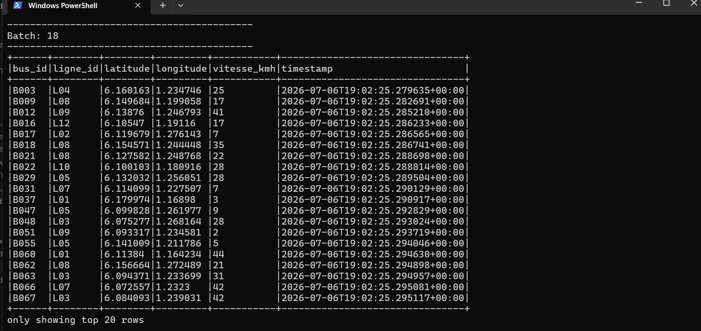
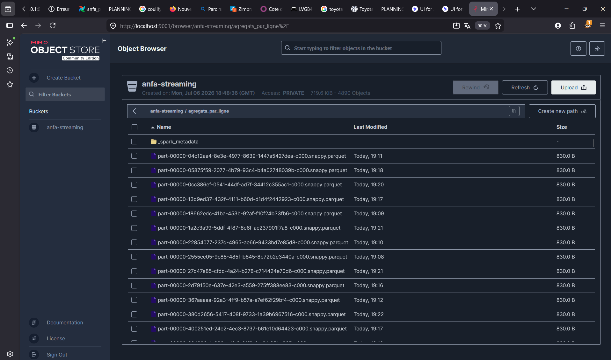

# Rendu Séance 7

**Nom et prénom :** Kaled Tchagba

## Résumé de la séance

Cette séance m'a permis de mettre en place un vrai cluster Kafka à 3 brokers en mode KRaft,
sans Zookeeper. J'ai créé un topic partitionné, testé un producer et un consumer Python basiques,
puis simulé 100 bus Anfa qui envoient leur position GPS en continu. J'ai aussi coupé un broker
en plein envoi pour vérifier que le cluster tenait le coup — et effectivement, rien ne s'est
arrêté. La dernière partie avec Spark Structured Streaming était la plus intéressante : lire
un flux Kafka en temps réel, calculer des agrégats par fenêtre de 30 secondes et écrire les
résultats en Parquet dans MinIO, c'est concrètement ce qu'on ferait en prod pour suivre une
flotte en direct.

## Étapes principales

1. **Récupération des fichiers** : `git fetch upstream && git merge upstream/main` pour avoir
   le dossier `seance-07/` avec le compose, les producers et les jobs Spark. Création de la
   branche `seance-07`.
2. **Lancement de la stack** : `docker compose up -d` — 7 conteneurs au total. Les 3 brokers
   Kafka ont pris environ 30 secondes à former le cluster KRaft entre eux.
3. **Création du topic** : `anfa-positions-bus` avec 3 partitions et réplication 3 via
   `kafka-topics.sh`. Les leaders se sont répartis automatiquement : partition 0 sur le broker 3,
   partition 1 sur le broker 1, partition 2 sur le broker 2.
4. **Producer et consumer Python** : le producer envoie 5 messages avec la clé `"B001"` —
   tous atterrissent dans la même partition (garantie d'ordre par clé). Relancer le consumer
   avec le même `group_id` ne relit rien : Kafka a mémorisé l'offset, c'est le comportement
   normal.
5. **Simulation de la flotte** : `simulateur_flotte.py` envoie une vague de 100 positions par
   seconde. Au bout de quelques minutes, le topic comptait plus de 157 000 messages répartis
   sur les 3 partitions.
6. **Tolérance aux pannes** : j'ai arrêté `anfa-kafka-2` avec `docker stop`. Dans Kafka UI,
   le broker 2 a disparu de la liste et les partitions dont il était leader ont basculé sur
   les brokers 1 et 3. Le simulateur n'a pas raté un seul message. En relançant kafka-2,
   il s'est resynchronisé tout seul en quelques secondes.
7. **Spark Structured Streaming** : le job console (`lecture_flux_console.py`) affiche les
   positions en micro-batchs de 5 secondes — on voit les bus défiler en direct. Le job
   d'agrégation (`agregation_streaming.py`) calcule toutes les 30 secondes le nombre de
   positions reçues et la vitesse moyenne par ligne, avec un watermark d'une minute pour
   absorber les messages en retard, et écrit les résultats en Parquet dans MinIO.

## Captures d'écran

### 3 brokers actifs dans Kafka UI

### Débit de messages en augmentation — simulateur en cours

### Cluster avec 2 brokers sur 3 après l'arrêt volontaire de kafka-2

### Micro-batchs de positions GPS affichés en console par Spark

### Fichiers Parquet des agrégats dans MinIO

## Réflexion : streaming vs batch, quand choisir quoi ?

Jusqu'ici on travaillait en batch : Airflow déclenche un job Spark à heure fixe, Spark lit
des fichiers déjà stockés, produit un résultat, et s'arrête. C'est bien pour un rapport
quotidien ou un traitement qui n'a pas besoin d'être immédiat.

Mais pour suivre 100 bus en temps réel, le batch ne suffit pas. Si un bus est bloqué depuis
10 minutes, je veux le savoir maintenant, pas dans le rapport de demain matin. C'est là que
Kafka + Spark Streaming a du sens : la latence passe de plusieurs minutes à quelques secondes.

Ce que la partie tolérance aux pannes m'a vraiment montré, c'est pourquoi on réplique sur 3
brokers et pas 1. Quand kafka-2 est tombé, les partitions dont il était leader ont migré vers
kafka-1 et kafka-3 qui avaient déjà des copies synchronisées. Le `MIN_INSYNC_REPLICAS: 2`
garantissait qu'on pouvait encore valider les écritures avec seulement 2 brokers. Sans ça,
perdre un broker aurait coupé la production de messages.

Je garderais le batch Airflow pour les traitements lourds qui ont besoin de toutes les données
de la journée (calcul de fréquentation, rapports). Le streaming Kafka/Spark serait réservé aux
cas où la réactivité compte vraiment : alertes en temps réel, tableau de bord opérationnel,
détection d'anomalies à la volée.

## Difficultés rencontrées

**Encodage Windows** : le caractère `→` dans `premier_consumer.py` fait planter le script sur
Windows avec une `UnicodeEncodeError` (l'encodage cp1252 ne le connaît pas). J'ai remplacé
`→` par `->` pour contourner le problème.

**Processus spark-submit bloqués** : après avoir interrompu un job Spark, les processus
`spark-submit` continuaient de tourner à l'intérieur du conteneur et occupaient le seul core
disponible du worker. Le job suivant restait bloqué sur `"Initial job has not accepted any
resources"`. Il fallait identifier les PIDs avec `ps aux` dans le conteneur et les tuer
manuellement avant de relancer.
