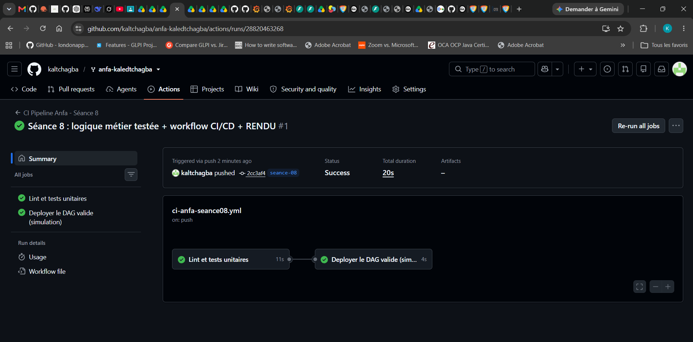
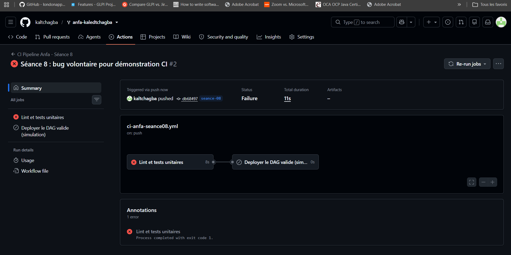

# Rendu — Séance 8

**Nom et prénom :** Kaled Tchagba  
**Identifiant GitHub :** kaltchagba  
**Date de soumission :** 06/07/2026

## Résumé de la séance

Cette séance était centrée sur la qualité du code et l'automatisation des vérifications.
On a extrait la logique métier du DAG Airflow dans un module `anfa_logic.py` indépendant,
ce qui permet de la tester sans avoir besoin d'Airflow, de MinIO ou d'un réseau. Ensuite
j'ai écrit 5 tests unitaires avec pytest, puis configuré un pipeline GitHub Actions qui
lance le lint et les tests automatiquement à chaque push. La partie la plus intéressante
était de montrer concrètement qu'un bug dans la logique bloque le déploiement — le job
`deployer` ne s'exécute pas tant que `valider-dag` n'est pas vert.

## Étapes principales

1. **Séparation de la logique métier** : les fonctions `construire_cle_trajets`,
   `verifier_liste_fichiers` et `construire_message_notification` ont été déplacées
   dans `anfa_logic.py`, sans aucune dépendance à Airflow ou boto3. Le DAG se contente
   de les appeler.

2. **5 tests unitaires** : `test_anfa_logic.py` couvre les cas nominaux et le cas
   d'erreur (liste vide lève `ValueError`). Résultat local : `5 passed in 0.05s` avec
   `pytest -v`.

3. **Workflow GitHub Actions** : deux jobs chaînés avec `needs:` —
   `valider-dag` (flake8 + pytest) puis `deployer` (copie des fichiers vers un dossier
   `deploiement_simule/`). Si un test échoue, `deployer` est automatiquement annulé.

4. **Démonstration du bug bloquant** : j'ai cassé volontairement `verifier_liste_fichiers`
   en remplaçant `raise ValueError` par `return {}` pour la liste vide. Le test
   `test_verifier_liste_fichiers_leve_erreur_si_vide` a échoué, le workflow est passé
   en rouge, et le job `deployer` n'a pas été déclenché. Après correction du bug,
   le second push a tout remis au vert.

## Captures d'écran

### Workflow réussi (2 jobs)

### Job en échec, déploiement non exécuté

## Réflexion personnelle

Dans le CM, l'incident de Mawuli vient d'un DAG déployé directement en production sans
aucune vérification automatique — une erreur dans la logique a silencieusement produit
des résultats faux pendant plusieurs jours avant d'être détectée manuellement.

Avec ce pipeline CI/CD, la situation aurait été différente dès la première étape : le bug
aurait déclenché un test en échec sur le premier push, et le déploiement n'aurait jamais
eu lieu. `needs: valider-dag` est la clé ici — sans cette ligne, GitHub Actions lancerait
les deux jobs en parallèle et le déploiement se ferait même si les tests échouent. Avec
`needs:`, il y a une dépendance stricte : pas de vert sur les tests = pas de déploiement.

Ce qui change concrètement, c'est qu'on n'a plus à faire confiance à la mémoire ou à
la rigueur du développeur en fin de journée. La machine vérifie à chaque push, de façon
identique, sans fatigue. Pour un pipeline de données qui tourne la nuit en production,
c'est exactement ce qu'il faut.

## Difficultés rencontrées

Rien de bloquant sur cette séance. Le seul point d'attention : `sys.path.insert` dans
`test_anfa_logic.py` pour que pytest trouve `anfa_logic.py` dans `../dags/` sans avoir
à installer le module. En CI, le `working-directory: seance-08` dans le workflow évite
d'avoir à ajuster les chemins.
