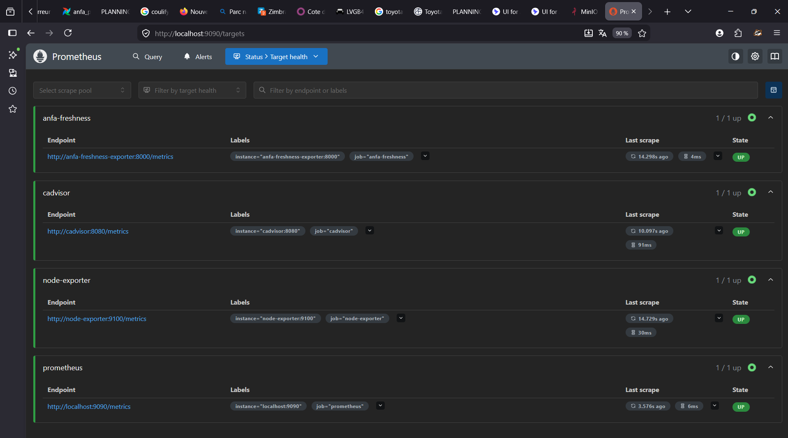
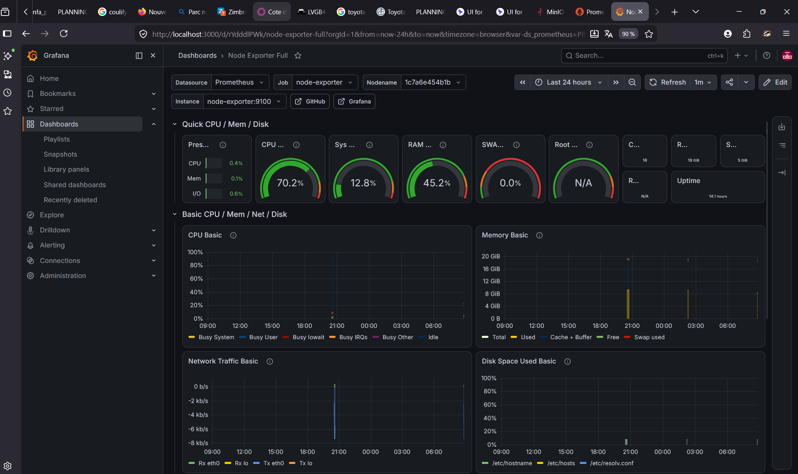
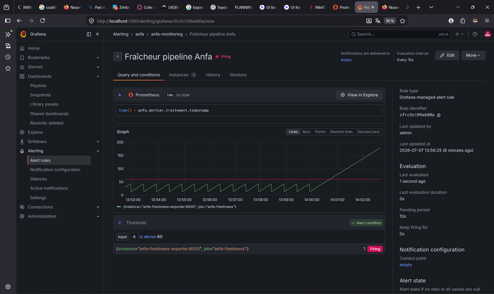

# Rendu — Séance 9

**Nom et prénom :** Kaled Tchagba  
**Identifiant GitHub :** kaltchagba  
**Date de soumission :** 07/07/2026

## Résumé de la séance

Cette séance m'a permis de mettre en place une stack de monitoring complète avec
Prometheus et Grafana autour du pipeline Anfa. On a collecté des métriques système
(CPU, RAM, disque via Node Exporter), des métriques conteneurs (cAdvisor), et surtout
une métrique métier custom : la fraîcheur des données, c'est-à-dire combien de secondes
se sont écoulées depuis le dernier traitement réussi. La partie la plus parlante était
la simulation de panne silencieuse — le pipeline s'arrête de produire sans planter,
et seule la métrique de fraîcheur permet de le détecter. L'alerte Grafana s'est
déclenchée automatiquement quand la fraîcheur a dépassé le seuil configuré.

## Étapes principales

1. **Déploiement de la stack** : `docker compose up -d --build` — 5 services au total.
   L'exportateur custom est buildé depuis `exporter/Dockerfile` (image Python 3.11-slim
   avec `prometheus-client`). Toutes les cibles sont apparues UP dans Prometheus en
   moins de 30 secondes.

2. **Exploration Prometheus** : `http://localhost:9090/targets` montre les 4 cibles
   actives — prometheus, node-exporter, cadvisor, anfa-freshness — toutes à l'état UP.
   Premières requêtes PromQL : `node_cpu_seconds_total`, `container_memory_usage_bytes`,
   puis `time() - anfa_dernier_traitement_timestamp` pour voir la fraîcheur en secondes.

3. **Dashboard Grafana** : import du dashboard communautaire "Node Exporter Full"
   (ID 1860) via Grafana → Dashboards → Import. La datasource Prometheus est
   préconfigurée automatiquement via le fichier de provisioning. Ajout d'un panneau
   custom avec `time() - anfa_dernier_traitement_timestamp` pour visualiser la fraîcheur.

4. **Alerte Grafana** : création d'une règle d'alerte sur la fraîcheur avec le seuil
   de 60 secondes (2× l'intervalle de 30s du simulateur). Evaluation toutes les 10s
   pendant 10s. L'alerte passe en Pending dès que la fraîcheur dépasse 60s, puis
   en Firing après la période d'évaluation.

5. **Simulation de panne** : `docker exec anfa-freshness-exporter touch /tmp/anfa_en_panne`
   — le conteneur reste actif et continue d'exposer `/metrics`, mais le timestamp
   cesse d'être mis à jour. En moins de 90 secondes l'alerte est passée en Firing,
   confirmant que la métrique de fraîcheur détecte ce que le statut conteneur ne
   montre pas.

## Captures d'écran

### Les 4 cibles Prometheus à l'état UP

### Dashboard "Node Exporter Full" importé

### Alerte à l'état Firing après panne simulée

## Réflexion personnelle

Dans le CM, Awa avait un pipeline de données qui s'était silencieusement arrêté de
produire des résultats. Les outils classiques — statut des conteneurs, CPU, RAM —
ne montraient rien d'anormal : le processus tournait, les ressources étaient consommées
normalement. Ce n'est qu'en regardant les fichiers de sortie plusieurs heures après
qu'on a réalisé que le pipeline était en panne.

La métrique de fraîcheur répond exactement à ce problème. Ce n'est pas une métrique
technique (le processus est-il vivant ?) mais une métrique métier (le pipeline
a-t-il produit un résultat récemment ?). Ces deux questions ont des réponses
indépendantes — c'est précisément ce que la simulation de panne démontre : le
conteneur est UP, mais la fraîcheur monte sans jamais redescendre.

Ce que cette séance change concrètement : avec une alerte sur `time() -
anfa_dernier_traitement_timestamp > 60`, Awa aurait été notifiée en moins de 2 minutes
après l'arrêt silencieux du pipeline, au lieu de le découvrir des heures plus tard
à la main.

## Difficultés rencontrées

Aucune difficulté technique bloquante. Point d'attention : sur Windows avec Docker
Desktop (backend WSL2), les métriques cAdvisor reflètent la VM Linux interne et non
la machine Windows hôte — les valeurs CPU/RAM visibles sont celles de la VM, pas de
Windows. Comportement documenté et attendu.
